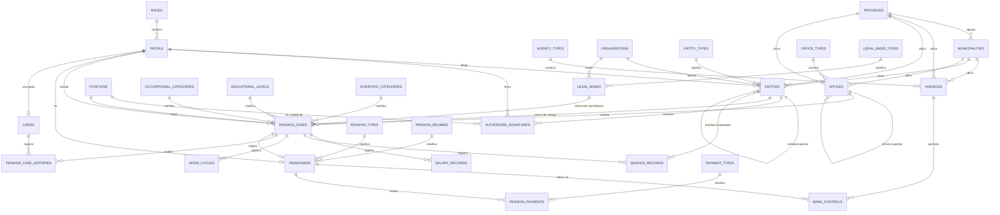
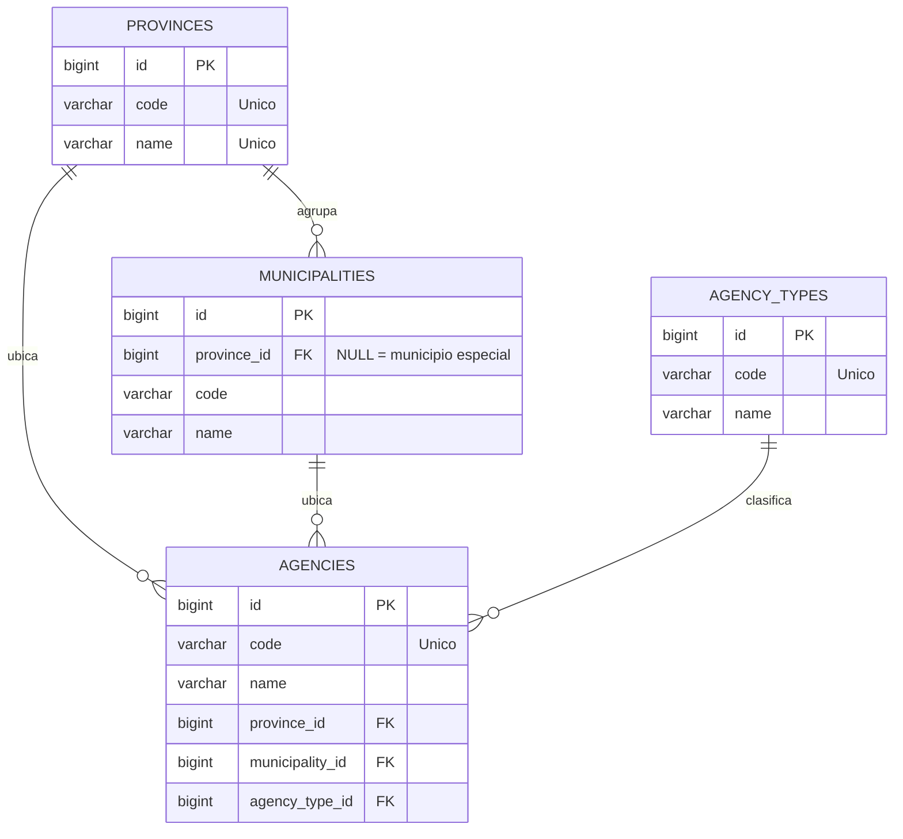
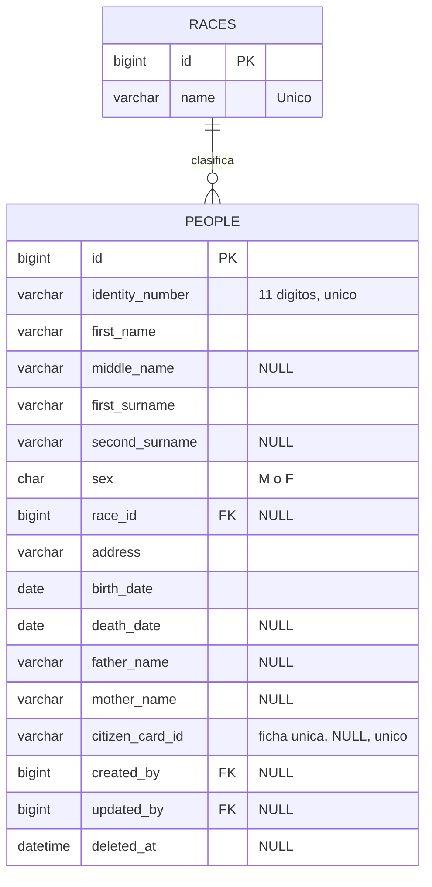
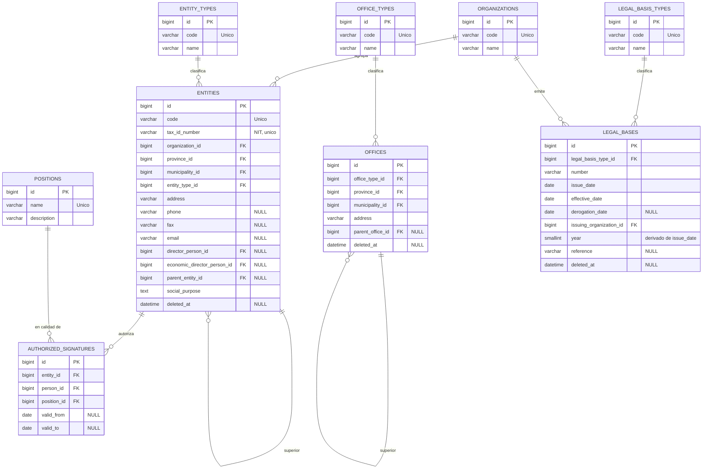
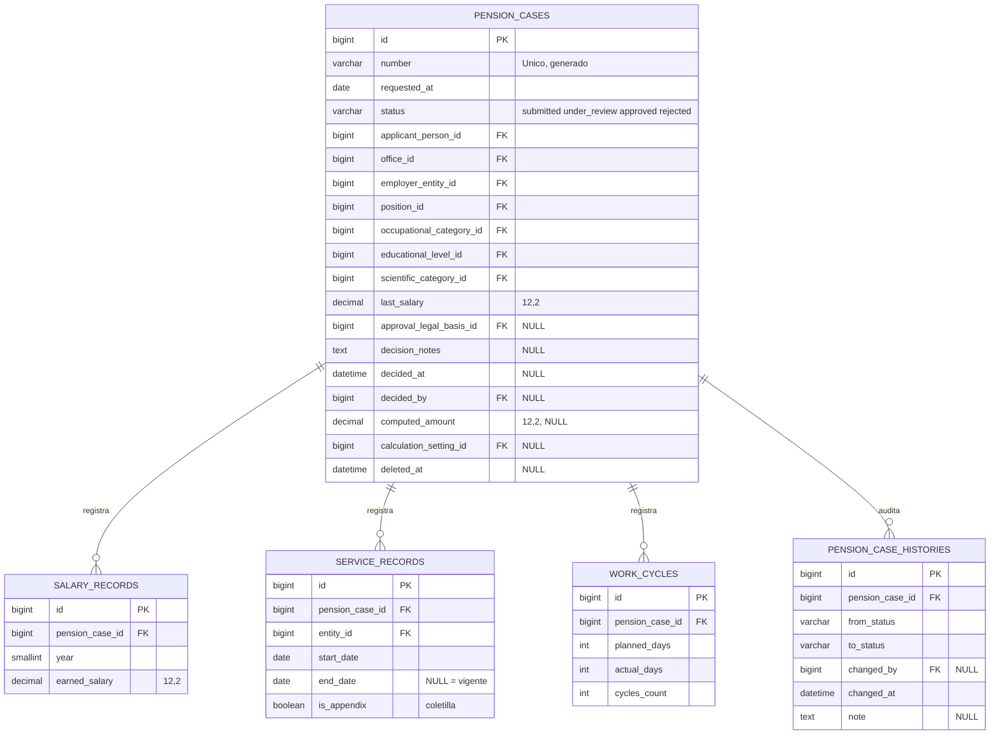
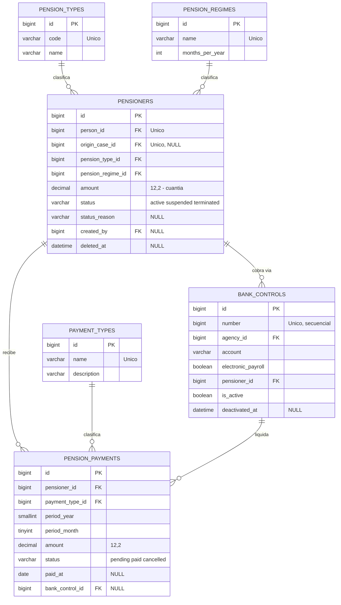
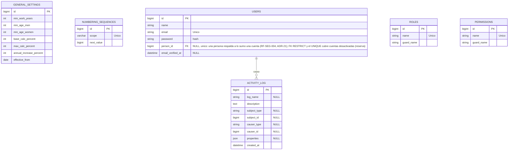

# Modelo de Datos — Sistema de Gestión de Pensionados (SGP)

| Campo | Valor |
|---|---|
| Proyecto | Sistema de Gestión de Pensionados (SGP) |
| Cliente | Ministerio de Trabajo |
| Documento | Modelo de Datos |
| Versión | 1.5 |
| Fecha | 2026-09-27 |
| Estado | Borrador para revisión del equipo de desarrollo |
| Documentos relacionados | `Requisitos funcionales.md`, `Diseño de arquitectura.md` |

---

## 1. Introducción y convenciones

### 1.1 Propósito

Este documento traduce el modelo conceptual entregado (`mdeditor.a8RzJZB8.md`) al modelo lógico-físico definitivo para MySQL 8.4: corrige los defectos detectados en el análisis (sección 2), establece el diccionario de datos completo, los diagramas entidad-relación, los dominios restringidos, las reglas de integridad, los índices y los artefactos Laravel (migraciones y seeders). Es la referencia única para desarrolladores: si una tabla o columna no está aquí, no existe.

### 1.2 Convenciones generales

| Aspecto | Convención |
|---|---|
| Motor y charset | MySQL 8.4 LTS, InnoDB, `utf8mb4` / `utf8mb4_0900_ai_ci` |
| Nomenclatura | Tablas y columnas en inglés `snake_case` plural/singular; glosario de equivalencias en la sección 3 |
| Clave primaria | `id BIGINT UNSIGNED AUTO_INCREMENT` surrogate en todas las tablas |
| Auditoría temporal | `created_at`, `updated_at` TIMESTAMP NULL en todas; `deleted_at` (soft delete) en tablas de negocio |
| Autoría | `created_by`, `updated_by` BIGINT UNSIGNED NULL → `users.id` en tablas de negocio críticas |
| Dinero | Siempre `DECIMAL(12,2)`; nunca FLOAT/DOUBLE (RN-005, RNF-008) |
| Enumeraciones | PHP backed enum + `VARCHAR(20)` + `CHECK` en BD; valores en inglés `snake_case` |
| Claves foráneas | Naming `tabla_fk_columna_foreign`; `ON DELETE RESTRICT` `ON UPDATE CASCADE` por defecto; FKs siempre indexadas |
| Unicidad | Constraints `UNIQUE` explícitos para toda clave natural (RN-008) |
| Catálogos | PK surrogate + `UNIQUE(name)`; `code` solo donde el dominio original lo define; baja lógica solo cuando tienen referencias potenciales |

## 2. Análisis del modelo conceptual y correcciones

El análisis completo de hallazgos (severidad y decisiones) consta en `Requisitos funcionales.md` sección 3 (H-01…H-16). Aquí se documentan las correcciones con impacto directo en el esquema:

| Hallazgo | Corrección aplicada al esquema |
|---|---|
| H-01 Persona como catálogo | `people` es tabla de negocio del módulo People con auditoría y soft delete |
| H-02/H-03 dinero Double/int | `last_salary`, `earned_salary`, `amount` (cuantía) y montos de pago: `DECIMAL(12,2)` |
| H-04 Expediente↔Pensionado ausente | `pensioners.origin_case_id` FK `UNIQUE` hacia `pension_cases` |
| H-05 Base legal huérfana | `pension_cases.approval_legal_basis_id` FK hacia `legal_bases` |
| H-06 contador en configuración | tabla `numbering_sequences` con bloqueo pesimista; `general_settings` queda puramente paramétrica y versionada (`effective_from`) |
| H-08 unicidades implícitas | `UNIQUE` en: CI, ficha única, códigos de catálogo, NIT, número de expediente, número de control, terna de firma, par caso-año de salarios, terna tipo-número-año legal |
| H-09 sin auditoría | `created_by/updated_by`, `deleted_at`, `activity_log` (spatie) y `pension_case_histories` |
| H-10 estado texto libre | `status VARCHAR(20)` + `CHECK IN (...)` respaldando el enum PHP `CaseStatus` |
| H-11 año redundante | `year SMALLINT` derivado de `issue_date`, indexado para consulta documental |
| H-12 catálogos heterogéneos | PK surrogate + `UNIQUE(name)` uniforme; `code` preservado solo en catálogos que lo traen del dominio |
| H-13 provincia+municipio redundante | ambas columnas se mantienen (conveniencia de consulta) + validación RN-004 en aplicación |
| H-16 sin pagos | tabla propuesta `pension_payments`, marcada (P), pendiente de validación funcional |

Correcciones semánticas de nomenclatura: `proponente` (era "propovente"), `firma autorizada` (era "atorizada"), `ciclo` y `cantidad de ciclos` (eran "cliclo"/"clicos"), `nivel educacional` (era "eduacional").

## 3. Glosario de equivalencias ES↔EN

| Concepto del dominio (ES) | Tabla (EN) | Modelo Eloquent |
|---|---|---|
| Provincia | `provinces` | `Province` |
| Municipio | `municipalities` | `Municipality` |
| Tipo de agencia | `agency_types` | `AgencyType` |
| Agencia | `agencies` | `Agency` |
| Organismo | `organizations` | `Organization` |
| Categoría científica | `scientific_categories` | `ScientificCategory` |
| Nivel educacional | `educational_levels` | `EducationalLevel` |
| Categoría ocupacional | `occupational_categories` | `OccupationalCategory` |
| Tipo de pensión | `pension_types` | `PensionType` |
| Tipo de beneficiario | `beneficiary_types` | `BeneficiaryType` |
| Raza | `races` | `Race` |
| Persona | `people` | `Person` |
| Cargo | `positions` | `Position` |
| Régimen de pensión | `pension_regimes` | `PensionRegime` |
| Tipo de pago | `payment_types` | `PaymentType` |
| Concepto de ingreso | `income_concepts` | `IncomeConcept` |
| Configuración general | `general_settings` | `GeneralSetting` |
| Secuencia de numeración | `numbering_sequences` | `NumberingSequence` |
| Tipo de entidad | `entity_types` | `EntityType` |
| Tipo de oficina | `office_types` | `OfficeType` |
| Oficina | `offices` | `Office` |
| Entidad | `entities` | `Entity` |
| Firma autorizada | `authorized_signatures` | `AuthorizedSignature` |
| Tipo de base legal | `legal_basis_types` | `LegalBasisType` |
| Base legal | `legal_bases` | `LegalBasis` |
| Expediente | `pension_cases` | `PensionCase` |
| Ciclo (de trabajo) | `work_cycles` | `WorkCycle` |
| Registro de salario | `salary_records` | `SalaryRecord` |
| Registro de servicio | `service_records` | `ServiceRecord` |
| Historial del expediente | `pension_case_histories` | `PensionCaseHistory` |
| Pensionado | `pensioners` | `Pensioner` |
| Control bancario | `bank_controls` | `BankControl` |
| Pago de pensión (propuesta) | `pension_payments` | `PensionPayment` |
| Usuario | `users` | `User` |
| Bitácora de acciones | `activity_log` | (spatie/activitylog) |

Nota sobre `pension_cases`: se evita el nombre natural `cases` porque `case` es palabra reservada de PHP (`match`/`switch`) y rompería la generación del modelo Eloquent.

## 4. Diagramas entidad-relación (Mermaid)

### 4.1 Panorama general

Vista completa de entidades y relaciones; los atributos se detallan por área en 4.2–4.7.



Entidades sin relación externa en el diagrama (autónomas): `general_settings` (versión de parámetros consumida por el motor de cálculo), `numbering_sequences` (numeración centralizada), `beneficiary_types` e `income_concepts` (catálogos de referencia con uso previsto en el motor de cálculo y en la futura extensión de beneficiarios, pregunta abierta P-04).

### 4.2 Geografía y agencias



`municipalities.province_id` es nullable para modelar el municipio especial Isla de la Juventud, que no pertenece a provincia alguna (168 municipios en total).

### 4.3 Personas



### 4.4 Estructura organizacional y base legal



### 4.5 Expediente y subregistros



`computed_amount` + `calculation_setting_id` congelan el resultado del cálculo al aprobar (RF-CAL-007/008): el expediente resuelto nunca se recalcula.

### 4.6 Pensionados y pagos



`pension_payments` es la extensión propuesta (H-16) para el módulo de pagos; se construye solo si el área funcional valida RF-PAG-005.

### 4.7 Configuración, secuencias, seguridad y auditoría



`roles`, `permissions` y sus tablas puente (`model_has_roles`, `model_has_permissions`, `role_has_permissions`) siguen el esquema estándar de spatie/laravel-permission y se crean desde su migración vendor; no se duplican aquí.

## 5. Diccionario de datos

**Columnas comunes** a todas las tablas (no se repiten en cada definición): `id BIGINT UNSIGNED AUTO_INCREMENT PRIMARY KEY`, `created_at TIMESTAMP NULL`, `updated_at TIMESTAMP NULL`. Las tablas de negocio añaden `deleted_at TIMESTAMP NULL` (soft delete) y, donde se indica, `created_by`/`updated_by` BIGINT UNSIGNED NULL → `users.id`. Todas las FK son `BIGINT UNSIGNED` con índice.

### 5.1 Catálogos geográficos y organizacionales

**`provinces`** — Provincias (15 filas sembradas).

| Columna | Tipo | Nulo | Clave | Descripción |
|---|---|---|---|---|
| code | VARCHAR(4) | NO | UNIQUE | Código oficial de la provincia |
| name | VARCHAR(80) | NO | UNIQUE | Nombre |

**`municipalities`** — Municipios (168 filas sembradas).

| Columna | Tipo | Nulo | Clave | Descripción |
|---|---|---|---|---|
| province_id | BIGINT UNSIGNED | SÍ | FK → provinces | NULL = municipio especial (Isla de la Juventud) |
| code | VARCHAR(4) | NO | — | Código del municipio |
| name | VARCHAR(80) | NO | — | Nombre |
| — | — | — | UNIQUE | (`province_id`, `code`) |

**`agency_types`** — Tipos de agencia bancaria. `code VARCHAR(4) UNIQUE`, `name VARCHAR(80) UNIQUE`.

**`agencies`** — Agencias bancarias.

| Columna | Tipo | Nulo | Clave | Descripción |
|---|---|---|---|---|
| code | VARCHAR(10) | NO | UNIQUE | Código de la agencia |
| name | VARCHAR(120) | NO | — | Nombre |
| province_id | BIGINT UNSIGNED | NO | FK → provinces | Provincia |
| municipality_id | BIGINT UNSIGNED | NO | FK → municipalities | Municipio (debe pertenecer a la provincia, RN-004) |
| agency_type_id | BIGINT UNSIGNED | NO | FK → agency_types | Tipo |

**`organizations`** — Organismos (OACE y equivalentes). `code VARCHAR(10) UNIQUE`, `name VARCHAR(120) UNIQUE`.

**`entity_types`** — Tipos de entidad. `code VARCHAR(10) UNIQUE`, `name VARCHAR(80) UNIQUE`.

**`office_types`** — Tipos de oficina (nacional, provincial, municipal). `code VARCHAR(10) UNIQUE`, `name VARCHAR(80) UNIQUE`.

### 5.2 Catálogos clasificatorios

Patrón común: PK surrogate + `name VARCHAR(80) NOT NULL UNIQUE` + los campos propios. Se listan solo los campos propios:

| Tabla | Campos propios | Semilla de referencia (a validar, P-06) |
|---|---|---|
| `scientific_categories` | `code VARCHAR(10) UNIQUE` | Investigador Titular/Auxiliar, Profesor Titular/Auxiliar… |
| `educational_levels` | `description VARCHAR(255) NULL` | Primaria, Secundaria Básica, Técnico Medio, Preuniversitario, Nivel Superior |
| `occupational_categories` | `code VARCHAR(10) UNIQUE` | Dirigente, Especialista, Técnico, Obrero, Servicios |
| `pension_types` | `code VARCHAR(10) UNIQUE` | Por edad, Por invalidez, Por sobrevivencia |
| `beneficiary_types` | `description VARCHAR(255) NULL` | Titular, Viuda/o, Huérfano, Otro (uso futuro, P-04) |
| `races` | — | Blanca, Negra, Mestiza o Mulata, China, Otra |
| `positions` | `description VARCHAR(255) NULL` | Cargos del centro de trabajo |
| `pension_regimes` | `months_per_year INT UNSIGNED NOT NULL CHECK (> 0)` | General (12); especiales a validar (P-02) |
| `payment_types` | `description VARCHAR(255) NULL` | Abono bancario, Cheque, Efectivo |
| `income_concepts` | `description VARCHAR(255) NULL`, `applies_base_salary TINYINT(1) NOT NULL DEFAULT 0` | Salario base (1), pagos por resultados (0)… |

`pension_regimes` incluye además `description VARCHAR(255) NULL` documentando la regla de cómputo del régimen.

### 5.3 Configuración y secuencias

**`general_settings`** — Parámetros de cálculo versionados (una fila por vigencia).

| Columna | Tipo | Nulo | Clave | Descripción |
|---|---|---|---|---|
| min_work_years | INT UNSIGNED | NO | — | Años mínimos de trabajo |
| min_age_men | INT UNSIGNED | NO | — | Edad mínima hombres |
| min_age_women | INT UNSIGNED | NO | — | Edad mínima mujeres |
| base_calc_percent | INT UNSIGNED | NO | — | Por ciento de cálculo base (0-100) |
| max_calc_percent | INT UNSIGNED | NO | — | Por ciento máximo (≥ base) |
| annual_increase_percent | INT UNSIGNED | NO | — | Por ciento de incremento anual por excedencia |
| effective_from | DATE | NO | UNIQUE | Entrada en vigor; UNIQUE en BD (ADR-16): fechas distintas particionan el tiempo sin solapamientos (RN-007/RN-008) |
| created_by / updated_by | BIGINT UNSIGNED | SÍ | FK → users | Autoría (ADR-14) |

CHECK: `max_calc_percent >= base_calc_percent`. La fila "vigente" es la de mayor `effective_from` ≤ fecha de cálculo (resolver puro `EffectiveSettingsResolver`, ADR-16). Las versiones son inmutables — la corrección crea una vigencia nueva (RF-CAT-005) — y solo las vigencias futuras (`effective_from` posterior a hoy) pueden eliminarse; la FK `pension_cases.calculation_setting_id` reforzará la regla. `effective_to` es derivado en lectura (día anterior a la siguiente vigencia; null en la más reciente), nunca se almacena. Sin soft delete: la historia debe permanecer reproducible (RN-007).

**`numbering_sequences`** — Secuencias centralizadas (reemplaza `ultimo control bancario` del modelo original, H-06).

| Columna | Tipo | Nulo | Clave | Descripción |
|---|---|---|---|---|
| scope | VARCHAR(40) | NO | UNIQUE | `bank_control`, `pension_case`, … |
| next_value | BIGINT UNSIGNED | NO | — | Próximo número a emitir |

Emisión (ADR-17): dentro de una transacción sobre la sesión dedicada `sequences` (clon de la conexión por defecto en `SettingsServiceProvider`), `SELECT ... FOR UPDATE` sobre la fila del scope, entregar el valor leído y persistir `next_value + 1`; el commit es independiente de la transacción de negocio del llamador, por lo que un rollback posterior quema el número — huecos permitidos, reutilización jamás (RN-009). Los scopes se declaran en `SettingsSeeder` (`bank_control`, `pension_case`) con `firstOrCreate` idempotente que nunca rebobina una secuencia consumida; un scope no declarado lanza `Shared\Exceptions\UnknownSequenceException`. Sin soft delete ni columnas de autoría: estado transaccional, no historia de negocio.

### 5.4 `people` — Personas

| Columna | Tipo | Nulo | Clave | Descripción |
|---|---|---|---|---|
| identity_number | VARCHAR(11) | NO | UNIQUE | Carné de identidad: 11 dígitos + dígito verificador (validador `CubanIdentityNumber`) |
| first_name | VARCHAR(50) | NO | — | Primer nombre |
| middle_name | VARCHAR(50) | SÍ | — | Segundo nombre |
| first_surname | VARCHAR(50) | NO | — | Primer apellido |
| second_surname | VARCHAR(50) | SÍ | — | Segundo apellido |
| sex | CHAR(1) | NO | CHECK | `M` o `F` |
| race_id | BIGINT UNSIGNED | SÍ | FK → races | Raza declarada |
| address | VARCHAR(255) | NO | — | Dirección de residencia |
| birth_date | DATE | NO | — | Fecha de nacimiento |
| death_date | DATE | SÍ | — | Fecha de fallecimiento; > birth_date (CHECK) |
| father_name | VARCHAR(120) | SÍ | — | Nombre del padre |
| mother_name | VARCHAR(120) | SÍ | — | Nombre de la madre |
| citizen_card_id | VARCHAR(30) | SÍ | UNIQUE | Ficha única de ciudadano |
| created_by / updated_by | BIGINT UNSIGNED | SÍ | FK → users | Autoría |
| deleted_at | TIMESTAMP | SÍ | — | Soft delete |

Índices de búsqueda: `idx_people_names (first_surname, first_name, birth_date)`.

Semántica de negocio (implementada, ADR-20): el carnet `identity_number` se valida estructuralmente con el value object `CubanIdentityNumber` de Shared (RN-001: prefijo siglo/sexo 1-6, fecha real del calendario, 11 dígitos; el dígito verificador sigue diferido a P-08) tanto en el dominio como como regla de request; es único e inmutable tras la creación, y el UNIQUE cubre también las filas desactivadas (el soft delete reserva la identidad para siempre). El control de duplicados al alta (RF-PER-005) vive en la política de dominio puro `DuplicatePolicy`: identidad ya registrada → 409 devolviendo la persona registrada (bloqueo no confirmable), homónimos vivos (mismo primer nombre + primer apellido + fecha de nacimiento) → 409 con los candidatos hasta que la petición lleve `confirm: true`; la ficha `citizen_card_id` es opcional, única y sondeada semánticamente antes del insert (RN-008). El fallecimiento (RF-PER-003) es una acción de ciclo de vida con endpoint propio `POST /people/{id}/death`: fija o corrige `death_date` (siempre auditada con el valor previo), exige fecha estrictamente posterior al nacimiento (guarda semántica + CHECK `chk_people_dates`) y nunca futura (`ClockInterface`); `deceased` se deriva de `death_date` en las lecturas y jamás se almacena. Borrado lógico con `people.delete` y autoría estampada por `AuditableObserver` (ADR-14); toda escritura aterriza en la bitácora append-only (ADR-19). La búsqueda (RF-PER-004) responde a `GET /api/v1/people` con `identity` exacto, `q` por palabras cruzando las cuatro columnas de nombres, `sex`, `deceased`, rango de nacimiento y paginación ordenada por `idx_people_names`.

### 5.5 Estructura organizacional

**`offices`** — Oficinas del Ministerio.

| Columna | Tipo | Nulo | Clave | Descripción |
|---|---|---|---|---|
| office_type_id | BIGINT UNSIGNED | NO | FK → office_types | Nacional/provincial/municipal |
| province_id | BIGINT UNSIGNED | NO | FK → provinces | Provincia |
| municipality_id | BIGINT UNSIGNED | NO | FK → municipalities | Municipio (RN-004) |
| address | VARCHAR(255) | NO | — | Dirección |
| parent_office_id | BIGINT UNSIGNED | SÍ | FK → offices | Oficina superior (jerarquía acíclica, RN-003) |
| deleted_at | TIMESTAMP | SÍ | — | Soft delete |

**`entities`** — Entidades empleadoras / centros de trabajo.

| Columna | Tipo | Nulo | Clave | Descripción |
|---|---|---|---|---|
| code | VARCHAR(15) | NO | UNIQUE | Código de la entidad |
| tax_id_number | VARCHAR(20) | NO | UNIQUE | NIT |
| organization_id | BIGINT UNSIGNED | NO | FK → organizations | Organismo de pertenencia |
| province_id | BIGINT UNSIGNED | NO | FK → provinces | Provincia |
| municipality_id | BIGINT UNSIGNED | NO | FK → municipalities | Municipio (RN-004) |
| entity_type_id | BIGINT UNSIGNED | NO | FK → entity_types | Tipo de entidad |
| address | VARCHAR(255) | NO | — | Dirección |
| phone | VARCHAR(30) | SÍ | — | Teléfono |
| fax | VARCHAR(30) | SÍ | — | Fax |
| email | VARCHAR(120) | SÍ | — | Correo (formato validado) |
| director_person_id | BIGINT UNSIGNED | SÍ | FK → people | Director general |
| economic_director_person_id | BIGINT UNSIGNED | SÍ | FK → people | Director económico |
| parent_entity_id | BIGINT UNSIGNED | SÍ | FK → entities | Entidad superior (jerarquía acíclica) |
| social_purpose | TEXT | NO | — | Objeto social |
| deleted_at | TIMESTAMP | SÍ | — | Soft delete |

**`authorized_signatures`** — Firmas autorizadas por entidad.

| Columna | Tipo | Nulo | Clave | Descripción |
|---|---|---|---|---|
| entity_id | BIGINT UNSIGNED | NO | FK → entities | Entidad que autoriza |
| person_id | BIGINT UNSIGNED | NO | FK → people | Persona autorizada |
| position_id | BIGINT UNSIGNED | NO | FK → positions | Cargo en que firma |
| valid_from | DATE | SÍ | — | Inicio de vigencia |
| valid_to | DATE | SÍ | — | Fin de vigencia (≥ valid_from, CHECK) |
| — | — | — | UNIQUE | (`entity_id`, `person_id`, `position_id`) |

**`positions`** — Cargos. `name VARCHAR(80) UNIQUE`, `description VARCHAR(255) NULL`.

Semántica de negocio (implementada, ADR-22; migraciones `2026_09_28_120000_create_entities_table`, `120001_create_offices_table` y `120002_create_authorized_signatures_table`): la aciclicidad de las jerarquías auto-referenciadas (RN-003) no es expresable como constraint declarativa de MySQL, así que la decide la política de dominio puro `HierarchyPolicy::wouldCreateCycle` antes de persistir — camina el mapa de padres activos desde el candidato hacia la raíz y bloquea con 422 cualquier re-enraizado que cierre un ciclo (self, 2-ciclo, 3-ciclo, cadena profunda); el mapa se deriva de la consulta de nodos activos y sus datasets válidos/inválidos son activos permanentes de regresión (S4.2). La coherencia geográfica (RN-004) usa el doble mecanismo de agencias: validación semántica 422 por campo en el servicio (municipio debe pertenecer a la provincia declarada, también al reubicar en PATCH contra el estado resultante) y FK compuesta `(municipality_id, province_id) → municipalities(id, province_id)` como última línea física. En `entities`, `code` y `tax_id_number` son UNIQUE, inmutables tras la creación y reservados por el soft delete (espejo de la reserva de identidad RN-001); la desactivación se rechaza (422) mientras existan entidades hijas activas — el árbol nunca huérfana un subárbol vivo — y los directores (`director_person_id`, `economic_director_person_id`) referencian personas registradas. La consulta de estructura (RF-ENT-005) expone `GET /entities/tree` y `GET /offices/tree`: árbol anidado con profundidad máxima 5 niveles y corte anunciado (`deeper: true` en el nodo del límite con descendencia) en lugar de ocultación silenciosa; el conteo de expedientes por oficina se incorpora en F3 con PensionCases. En `authorized_signatures`, la terna `(entity_id, person_id, position_id)` es UNIQUE cubriendo también las filas revocadas: la revocación es un soft delete auditado que preserva el historial y mantiene la terna reservada (no puede re-registrarse); la ventana de vigencia opcional cumple RN-006 (CHECK `chk_signature_dates: valid_to ≥ valid_from`) y el estado se deriva al leer con `SignatureStatus::resolve` contra el reloj compartido (`active`/`future`/`expired`, días inclusive, nunca almacenado); el filtrado por estado del listado se resuelve en SQL contra el mismo reloj. Autoría estampada por `AuditableObserver` y toda escritura — incluida la revocación — aterriza en la bitácora append-only (ADR-14/19).

### 5.6 Base legal

**`legal_basis_types`** — `code VARCHAR(10) UNIQUE`, `name VARCHAR(80) UNIQUE` (Ley, Decreto-Ley, Resolución, Indicación…).

**`legal_bases`** — Normas y resoluciones.

| Columna | Tipo | Nulo | Clave | Descripción |
|---|---|---|---|---|
| legal_basis_type_id | BIGINT UNSIGNED | NO | FK → legal_basis_types | Tipo |
| number | VARCHAR(30) | NO | — | Número del documento |
| issue_date | DATE | NO | — | Fecha de emisión |
| effective_date | DATE | NO | — | Puesta en vigor (≥ issue_date, CHECK) |
| derogation_date | DATE | SÍ | — | Derogación (≥ effective_date, CHECK); NULL = vigente |
| issuing_organization_id | BIGINT UNSIGNED | NO | FK → organizations | Organismo emisor |
| year | SMALLINT UNSIGNED | NO | — | Año, derivado de `issue_date` (H-11), indexado |
| reference | VARCHAR(255) | SÍ | — | Referencia documental adicional (Gaceta, etc.) |
| deleted_at | TIMESTAMP | SÍ | — | Soft delete |
| — | — | — | UNIQUE | (`legal_basis_type_id`, `number`, `year`) |

Semántica de negocio (implementada, ADR-23; migración `2026_09_28_130000_create_legal_bases_table`): la terna `(legal_basis_type_id, number, year)` es UNIQUE cubriendo también las filas desactivadas — el soft delete reserva la terna — e inmutable tras la creación: el año se DERIVA de `issue_date` dentro del `LegalBasisService` (H-11) y jamás viaja en la petición, de modo que la identidad de una norma no puede re-escribirse desde fuera; cambiar tipo, número o fecha de emisión responde 422. El orden de fechas RN-006 se valida contra el estado RESULTANTE en alta y edición (la PATCH mezcla las fechas viajadas con las almacenadas antes de comprobar) y queda respaldado por los CHECKs `chk_legal_basis_effective` (`effective_date ≥ issue_date`) y `chk_legal_basis_derogation` (`derogation_date ≥ effective_date`). La vigencia es estado DERIVADO al leer con `LegalBasisStatus::resolve` contra el reloj compartido — `future` (puesta en vigor por llegar), `effective` (en vigor: desde su `effective_date`, con cortes inclusivos), `derogated` (desde su `derogation_date`, ese día ya cuenta como derogada) — y jamás se almacena; el filtro del listado por estado se resuelve en SQL contra el mismo reloj, de modo que `status=effective` es literalmente el selector de vigentes que la aprobación de expedientes consumirá (RF-LEG-003; la regla de «forzar una derogada con advertencia» aterriza con PensionCases en F3, que posee la transición de aprobación). La derogación es una EDICIÓN de fecha auditable con valores previos (fijar, corregir o limpiar con null), nunca una acción destructiva propia; el borrado lógico desactiva la base y reserva la terna. `legal_basis_types` ya está servido por el recurso genérico de catálogos (ADR-15, RF-LEG-001) con semilla Ley/Decreto-Ley/Decreto/Resolución/Indicación. Autoría estampada por `AuditableObserver` y toda escritura aterriza en la bitácora append-only (ADR-14/19).

### 5.7 Expedientes y subregistros

**`pension_cases`** — Expediente de pensión (agregado raíz del módulo).

| Columna | Tipo | Nulo | Clave | Descripción |
|---|---|---|---|---|
| number | VARCHAR(20) | NO | UNIQUE | Número de expediente (secuencia `pension_case`) |
| requested_at | DATE | NO | — | Fecha de solicitud |
| status | VARCHAR(20) | NO | CHECK | `submitted` / `under_review` / `approved` / `rejected` (enum PHP `CaseStatus`) |
| applicant_person_id | BIGINT UNSIGNED | NO | FK → people | Proponente |
| office_id | BIGINT UNSIGNED | NO | FK → offices | Oficina tramitadora |
| employer_entity_id | BIGINT UNSIGNED | NO | FK → entities | Centro de trabajo |
| position_id | BIGINT UNSIGNED | NO | FK → positions | Cargo declarado |
| occupational_category_id | BIGINT UNSIGNED | NO | FK → occupational_categories | Categoría ocupacional |
| educational_level_id | BIGINT UNSIGNED | NO | FK → educational_levels | Nivel educacional |
| scientific_category_id | BIGINT UNSIGNED | NO | FK → scientific_categories | Categoría científica |
| last_salary | DECIMAL(12,2) | NO | CHECK ≥ 0 | Último salario |
| approval_legal_basis_id | BIGINT UNSIGNED | SÍ | FK → legal_bases | Resolución aprobatoria (H-05); obligatoria al aprobar |
| decision_notes | TEXT | SÍ | — | Nota de resolución o motivo de denegación |
| decided_at | DATETIME | SÍ | — | Momento de la decisión |
| decided_by | BIGINT UNSIGNED | SÍ | FK → users | Usuario decisor |
| computed_amount | DECIMAL(12,2) | SÍ | CHECK ≥ 0 | Cuantía calculada congelada al aprobar |
| calculation_setting_id | BIGINT UNSIGNED | SÍ | FK → general_settings | Versión de parámetros usada (RF-CAL-008) |
| created_by / updated_by | BIGINT UNSIGNED | SÍ | FK → users | Autoría |
| deleted_at | TIMESTAMP | SÍ | — | Soft delete |

Índice de gestión: `idx_cases_office_status (office_id, status, requested_at)`.

**`salary_records`** — Serie salarial anual.

| Columna | Tipo | Nulo | Clave | Descripción |
|---|---|---|---|---|
| pension_case_id | BIGINT UNSIGNED | NO | FK → pension_cases | Expediente |
| year | SMALLINT UNSIGNED | NO | — | Año (CHECK: 1950…año actual+1) |
| earned_salary | DECIMAL(12,2) | NO | CHECK ≥ 0 | Salario devengado |
| — | — | — | UNIQUE | (`pension_case_id`, `year`) |

**`service_records`** — Historial laboral.

| Columna | Tipo | Nulo | Clave | Descripción |
|---|---|---|---|---|
| pension_case_id | BIGINT UNSIGNED | NO | FK → pension_cases | Expediente |
| entity_id | BIGINT UNSIGNED | NO | FK → entities | Entidad empleadora |
| start_date | DATE | NO | — | Inicio del vínculo |
| end_date | DATE | SÍ | — | Fin del vínculo; NULL = vigente; CHECK ≥ start_date |
| is_appendix | TINYINT(1) | NO | DEFAULT 0 | Coletilla: servicio reconocido adicional |

Solapamientos y huecos se validan en la capa de dominio (RF-EXP-003); MySQL no los expresa como constraint.

**`work_cycles`** — Ciclos de trabajo.

| Columna | Tipo | Nulo | Clave | Descripción |
|---|---|---|---|---|
| pension_case_id | BIGINT UNSIGNED | NO | FK → pension_cases | Expediente |
| planned_days | INT UNSIGNED | NO | — | Días plan |
| actual_days | INT UNSIGNED | NO | — | Días reales |
| cycles_count | INT UNSIGNED | NO | — | Cantidad de ciclos |

**`pension_case_histories`** — Bitácora de transiciones (append-only, RN-010).

| Columna | Tipo | Nulo | Clave | Descripción |
|---|---|---|---|---|
| pension_case_id | BIGINT UNSIGNED | NO | FK → pension_cases | Expediente |
| from_status | VARCHAR(20) | NO | — | Estado previo |
| to_status | VARCHAR(20) | NO | — | Estado nuevo |
| changed_by | BIGINT UNSIGNED | SÍ | FK → users | Usuario responsable |
| changed_at | DATETIME | NO | — | Momento (índice) |
| note | TEXT | SÍ | — | Nota de la transición |

### 5.8 Pensionados y pagos

**`pensioners`** — Pensionados.

| Columna | Tipo | Nulo | Clave | Descripción |
|---|---|---|---|---|
| person_id | BIGINT UNSIGNED | NO | UNIQUE, FK → people | Persona pensionada (una pensión activa por persona) |
| origin_case_id | BIGINT UNSIGNED | SÍ | UNIQUE, FK → pension_cases | Expediente que lo origina (H-04) |
| pension_type_id | BIGINT UNSIGNED | NO | FK → pension_types | Tipo de pensión |
| pension_regime_id | BIGINT UNSIGNED | NO | FK → pension_regimes | Régimen |
| amount | DECIMAL(12,2) | NO | CHECK ≥ 0 | Cuantía (era `int`, corregido H-03) |
| status | VARCHAR(20) | NO | DEFAULT 'active', CHECK | `active` / `suspended` / `terminated` |
| status_reason | VARCHAR(255) | SÍ | — | Motivo del último cambio de estado |
| created_by / updated_by | BIGINT UNSIGNED | SÍ | FK → users | Autoría |
| deleted_at | TIMESTAMP | SÍ | — | Soft delete |

**`bank_controls`** — Control bancario del cobro.

| Columna | Tipo | Nulo | Clave | Descripción |
|---|---|---|---|---|
| number | BIGINT UNSIGNED | NO | UNIQUE | Número de control (secuencia `bank_control`, RN-009) |
| agency_id | BIGINT UNSIGNED | NO | FK → agencies | Agencia bancaria |
| account | VARCHAR(34) | NO | — | Cuenta bancaria |
| electronic_payroll | TINYINT(1) | NO | DEFAULT 0 | Nómina electrónica |
| pensioner_id | BIGINT UNSIGNED | NO | FK → pensioners | Pensionado |
| is_active | TINYINT(1) | NO | DEFAULT 1 | Control activo (unicidad de activo por pensionado en aplicación) |
| deactivated_at | DATETIME | SÍ | — | Momento de desactivación |

**`pension_payments`** (propuesta, H-16) — Pagos periódicos.

| Columna | Tipo | Nulo | Clave | Descripción |
|---|---|---|---|---|
| pensioner_id | BIGINT UNSIGNED | NO | FK → pensioners | Pensionado |
| payment_type_id | BIGINT UNSIGNED | NO | FK → payment_types | Tipo de pago |
| period_year | SMALLINT UNSIGNED | NO | — | Año del período |
| period_month | TINYINT UNSIGNED | NO | CHECK 1-12 | Mes del período |
| amount | DECIMAL(12,2) | NO | CHECK ≥ 0 | Importe liquidado |
| status | VARCHAR(20) | NO | DEFAULT 'pending', CHECK | `pending` / `paid` / `cancelled` |
| paid_at | DATE | SÍ | — | Fecha de pago efectivo |
| bank_control_id | BIGINT UNSIGNED | SÍ | FK → bank_controls | Control por el que se liquidó |
| — | — | — | UNIQUE | (`pensioner_id`, `period_year`, `period_month`, `payment_type_id`) |

### 5.9 Seguridad y auditoría

**`users`** — Esquema Laravel estándar + columnas de trazabilidad (implementadas, ADR-14): `created_by`/`updated_by` BIGINT UNSIGNED NULL FK → `users` (autoreferencial, `restrictOnDelete`) estampadas automáticamente por `AuditableObserver` según el actor autenticado, y `deleted_at` (soft delete; las cuentas borradas no pueden autenticarse). `person_id BIGINT UNSIGNED NULL UNIQUE FK → people` implementada (ADR-21). Contraseñas con hash Argon2id. Ciclo de vida de seguridad (implementadas, ADR-24, migración `2026_09_28_140000_add_lockout_and_password_lifecycle_to_users_table`): `failed_login_attempts` INT UNSIGNED DEFAULT 0 (intentos consecutivos, reinicio tras candado caducado), `locked_at` TIMESTAMP NULL (el estado de bloqueo se DERIVA al leer contra el TTL de la política — no existe unlocked_at) y `password_changed_at` TIMESTAMP NULL (línea base de la caducidad opcional; backfill desde `created_at`). El hash de la contraseña jamás entra a `activity_log`: `RedactsAuditAttributes` lo redacta como `[redacted]` (ADR-24).

**`roles` / `permissions` (+ pivots)** — Esquema estándar de spatie/laravel-permission 6 (implementadas, ADR-18): `roles` y `permissions` con UNIQUE compuesto (`name`, `guard_name`); `role_has_permissions`, `model_has_roles` y `model_has_permissions` (morphs, típicamente sobre `users`) materializan los enlaces. Fuente única de verdad: `PermissionMatrix`, valor de dominio puro del módulo Security con los 5 roles institucionales de la sección 2.2 (admin, director, specialist, operator, auditor) y 11 permisos iniciales `modulo.accion` (catalogs. y settings. view/manage, people. view/create/edit/delete, audit.view/export, users.manage); `RolesAndPermissionsSeeder` converge las tablas a la matriz (idempotente: `firstOrCreate` + `syncPermissions`).

**`activity_log`** — Esquema estándar de spatie/laravel-activitylog (implementada, ADR-19): `log_name`, `description`, `event` (`created|updated|deleted|restored`), `subject_type/subject_id` (morphs), `causer_type/causer_id` (morphs, típicamente `users`), `properties JSON` con `old` (valores previos), `attributes` (nuevos) y `request_id` (correlación de la solicitud HTTP), `created_at`. La escribe el `AuditTrailObserver` de Shared (patrón ADR-14: una línea de registro por módulo) para toda escritura crítica de catálogos, configuración y usuarios; tabla de solo inserción desde la aplicación (RN-010) — no existe ruta de mutación. Índices: `(subject_type, subject_id, created_at)`, `(causer_type, causer_id, created_at)` y `log_name`. Lectura filtrable vía `GET /api/v1/audit-logs` (permiso `audit.view`) con export CSV (`audit.export`, RF-AUD-003).

**Roles y permisos** — Tablas estándar de spatie/laravel-permission (`roles`, `permissions`, `model_has_roles`, `model_has_permissions`, `role_has_permissions`) generadas por el vendor. Semilla: roles `admin`, `director`, `specialist`, `operator`, `auditor` con la matriz de permisos del documento de arquitectura (sección 10).

## 6. Dominios restringidos (enums)

| Enum PHP | Valores (string backed) | Tabla.columna | Transiciones |
|---|---|---|---|
| `CaseStatus` | `submitted`, `under_review`, `approved`, `rejected` | `pension_cases.status` | submitted→under_review/rejected; under_review→approved/rejected/submitted; terminales con reapertura administrativa auditada |
| `PensionerStatus` | `active`, `suspended`, `terminated` | `pensioners.status` | active↔suspended; active/suspended→terminated (terminal) |
| `PaymentStatus` | `pending`, `paid`, `cancelled` | `pension_payments.status` | pending→paid/cancelled (propuesta) |
| `Sex` | `M`, `F` | `people.sex` (CHECK) | — |

Todos respaldados por `CHECK (col IN (...))` en MySQL 8.4, que los enforcement desde la versión 8.0.16.

## 7. Integridad referencial y transaccional

- **FK `ON DELETE RESTRICT`** en todas las referencias a catálogos y entidades: no se elimina física un registro referenciado; la baja es lógica.
- **Soft deletes** en tablas de negocio: `deleted_at`; los índices UNIQUE conviven con el borrado lógico mediante la práctica de renombrar la clave natural al eliminar (p. ej. sufijo `~~id~~`) cuando el negocio lo requiera, decisión documentada por tabla en la fase 1.
- **Transacciones**: aprobación de expediente (estado + congelado de cálculo + historial + alta de pensionado) y emisión de números de control son las dos operaciones transaccionales críticas; se describen en `Diseño de arquitectura.md` (secciones 7 y 8).
- **Anti-ciclos**: jerarquías `entities.parent_entity_id` y `offices.parent_office_id` se validan en dominio al editar (RN-003); no existe constraint nativa equivalente en MySQL.
- **Coherencia geográfica** (RN-004): validada en dominio; documentada como restricción de aplicación deliberada (la FK a municipio ya restringe el universo válido).

## 8. Índices y rendimiento

| Consulta frecuente | Índice que la sirve |
|---|---|
| Persona por CI | `people.identity_number` (UNIQUE) |
| Personas por apellidos/nombre | `idx_people_names (first_surname, first_name, birth_date)` |
| Expedientes por oficina y estado | `idx_cases_office_status (office_id, status, requested_at)` |
| Expedientes por proponente | FK `applicant_person_id` (índice automático) |
| Serie salarial del expediente | UNIQUE (`pension_case_id`, `year`) |
| Servicios por entidad | FK `entity_id` |
| Base legal por año/tipo | `legal_bases (year, legal_basis_type_id)` |
| Pensionados activos por tipo/régimen | `pensioners (status, pension_type_id, pension_regime_id)` |
| Controles activos por pensionado | `bank_controls (pensioner_id, is_active)` |
| Bitácora por sujeto | `activity_log (subject_type, subject_id, created_at)` |
| Pagos por período (propuesta) | UNIQUE (`pensioner_id`, `period_year`, `period_month`, `payment_type_id`) cubre rangos por pensionado; añadir `(period_year, period_month)` si se aprueba el módulo |

Volumetría esperada que calibra estos índices: ~500k personas, ~200k expedientes, ~3M registros de salario, ~600k pensionados acumulados a 10 años. Las agregaciones de reportes pesados se ejecutan en cola con lecturas indexadas por fecha; si RNF-002 se incumple, el plan de contención es tabla de resumen pre-agregada por noche, no desnormalizar el OLTP.

## 9. Migraciones de ejemplo (Laravel)

Extracto representativo del estándar de codificación (una tabla por migración, naming explícito, CHECKs finales):

```php
<?php
// database/migrations/2026_09_27_160000_create_people_table.php

use Illuminate\Database\Migrations\Migration;
use Illuminate\Database\Schema\Blueprint;
use Illuminate\Support\Facades\Schema;
use Illuminate\Support\Facades\DB;

return new class extends Migration
{
    public function up(): void
    {
        Schema::create('people', function (Blueprint $table) {
            $table->id();
            $table->string('identity_number', 11);
            $table->string('first_name', 50);
            $table->string('middle_name', 50)->nullable();
            $table->string('first_surname', 50);
            $table->string('second_surname', 50)->nullable();
            $table->char('sex', 1);
            $table->foreignId('race_id')->nullable()->constrained('races')->restrictOnDelete();
            $table->string('address', 255);
            $table->date('birth_date');
            $table->date('death_date')->nullable();
            $table->string('father_name', 120)->nullable();
            $table->string('mother_name', 120)->nullable();
            $table->string('citizen_card_id', 30)->nullable();
            $table->foreignId('created_by')->nullable()->constrained('users')->restrictOnDelete();
            $table->foreignId('updated_by')->nullable()->constrained('users')->restrictOnDelete();
            $table->timestamps();
            $table->softDeletes();

            $table->unique('identity_number');
            $table->unique('citizen_card_id');
            $table->index(['first_surname', 'first_name', 'birth_date'], 'idx_people_names');
        });

        DB::statement('ALTER TABLE people ADD CONSTRAINT chk_people_sex CHECK (sex IN (\'M\', \'F\'))');
        DB::statement('ALTER TABLE people ADD CONSTRAINT chk_people_dates CHECK (death_date IS NULL OR death_date > birth_date)');
    }

    public function down(): void
    {
        Schema::dropIfExists('people');
    }
};
```

```php
<?php
// database/migrations/2026_09_01_000060_create_pension_cases_table.php  (extracto de columnas clave)

Schema::create('pension_cases', function (Blueprint $table) {
    $table->id();
    $table->string('number', 20);
    $table->date('requested_at');
    $table->string('status', 20);
    $table->foreignId('applicant_person_id')->constrained('people')->restrictOnDelete();
    $table->foreignId('office_id')->constrained('offices')->restrictOnDelete();
    $table->foreignId('employer_entity_id')->constrained('entities')->restrictOnDelete();
    $table->foreignId('position_id')->constrained('positions')->restrictOnDelete();
    $table->foreignId('occupational_category_id')->constrained('occupational_categories')->restrictOnDelete();
    $table->foreignId('educational_level_id')->constrained('educational_levels')->restrictOnDelete();
    $table->foreignId('scientific_category_id')->constrained('scientific_categories')->restrictOnDelete();
    $table->decimal('last_salary', 12, 2);
    $table->foreignId('approval_legal_basis_id')->nullable()->constrained('legal_bases')->restrictOnDelete();
    $table->text('decision_notes')->nullable();
    $table->datetime('decided_at')->nullable();
    $table->foreignId('decided_by')->nullable()->constrained('users')->restrictOnDelete();
    $table->decimal('computed_amount', 12, 2)->nullable();
    $table->foreignId('calculation_setting_id')->nullable()->constrained('general_settings')->restrictOnDelete();
    $table->foreignId('created_by')->nullable()->constrained('users')->restrictOnDelete();
    $table->foreignId('updated_by')->nullable()->constrained('users')->restrictOnDelete();
    $table->timestamps();
    $table->softDeletes();

    $table->unique('number');
    $table->index(['office_id', 'status', 'requested_at'], 'idx_cases_office_status');
});
// + CHECK status IN ('submitted','under_review','approved','rejected')
// + CHECK last_salary >= 0
```

## 10. Carga inicial (seeders)

| Seeder | Contenido | Clave natural de upsert |
|---|---|---|
| `CubaGeographySeeder` | 15 provincias y 168 municipios (Isla de la Juventud con `province_id = NULL`) | `provinces.code`, (`municipalities.province_id`, `code`) |
| `OrganizationsSeeder` | Organismos de la Administración Central del Estado | `code` |
| `CatalogsSeeder` | Razas, niveles educacionales, categorías ocupacionales y científicas, tipos de pensión, tipos de beneficiario, tipos de agencia, tipos de entidad/oficina, tipos de pago, conceptos de ingreso, cargos base | `name` / `code` |
| `PensionRegimesSeeder` | Regímenes con `months_per_year` (general = 12; especiales según P-02) | `name` |
| `RolesAndPermissionsSeeder` | 5 roles y su matriz de permisos `modulo.accion` | `name` |
| `SettingsSeeder` | Configuración general inicial + secuencias `bank_control` y `pension_case` en 1 | `scope` / `effective_from` |

Ejemplo de estructura de datos de geografía (extracto):

```php
// database/seeders/data/cuba_geography.php  (extracto)
return [
    'provinces' => [
        ['code' => '01', 'name' => 'Pinar del Río'],
        ['code' => '02', 'name' => 'Artemisa'],
        // ... 15 provincias
        ['code' => '99', 'name' => 'Isla de la Juventud'], // usada solo como etiqueta del municipio especial
    ],
    'municipalities' => [
        ['province' => '01', 'code' => '001', 'name' => 'Pinar del Río'],
        // ... 167 municipios + municipio especial:
        ['province' => null, 'code' => '990', 'name' => 'Isla de la Juventud'],
    ],
];
```

Los catálogos de negocio (razas, niveles, categorías, tipos de pensión, regímenes) se siembran con valores de referencia **a validar por el área funcional (P-06)**; el seeder es la única fuente de esos datos — prohibido quemar valores en código o tests de feature (se usan factories con states).

## 11. Consultas SQL frecuentes (referencia)

```sql
-- Expedientes por estado y oficina en un rango (RF-REP-001)
SELECT o.name AS oficina, pc.status, COUNT(*) AS total
FROM pension_cases pc
JOIN offices o ON o.id = pc.office_id
WHERE pc.requested_at BETWEEN :from AND :to
  AND pc.deleted_at IS NULL
GROUP BY o.id, o.name, pc.status
ORDER BY o.name, pc.status;

-- Pensionados activos por provincia del control bancario (RF-REP-002)
SELECT p2.name AS provincia, pt.name AS tipo, COUNT(DISTINCT pe.id) AS pensionados,
       SUM(pe.amount) AS monto_total
FROM pensioners pe
JOIN pension_types pt ON pt.id = pe.pension_type_id
JOIN bank_controls bc ON bc.pensioner_id = pe.id AND bc.is_active = 1
JOIN agencies a ON a.id = bc.agency_id
JOIN provinces p2 ON p2.id = a.province_id
WHERE pe.status = 'active' AND pe.deleted_at IS NULL
GROUP BY p2.id, pt.name
ORDER BY pensionados DESC;

-- Serie salarial consolidada de un expediente (motor de cálculo)
SELECT sr.year, sr.earned_salary
FROM salary_records sr
WHERE sr.pension_case_id = :caseId
ORDER BY sr.year;

-- Última transición de cada expediente en revisión (bandeja del especialista)
SELECT pc.number, pc.requested_at, h.to_status, h.changed_at, u.name AS revisor
FROM pension_cases pc
JOIN pension_case_histories h ON h.pension_case_id = pc.id
  AND h.changed_at = (
      SELECT MAX(h2.changed_at) FROM pension_case_histories h2
      WHERE h2.pension_case_id = pc.id
  )
LEFT JOIN users u ON u.id = h.changed_by
WHERE pc.status = 'under_review' AND pc.deleted_at IS NULL;
```

## 12. Control de versiones del documento

| Versión | Fecha | Cambios | Autor |
|---|---|---|---|
| 1.0 | 2026-09-22 | Versión inicial: análisis de correcciones, glosario, ER, diccionario, índices, seeders | Arquitectura Backend |
| 1.1 | 2026-09-27 | Entrada `general_settings` actualizada (ADR-16): `effective_from` UNIQUE en BD (RN-007/RN-008), columnas de autoría `created_by`/`updated_by`, versiones inmutables sin soft delete y `effective_to` derivado en lectura | Arq. Backend |
| 1.2 | 2026-09-27 | Entrada `numbering_sequences` actualizada (ADR-17): emisión con `SELECT ... FOR UPDATE` sobre la sesión dedicada `sequences` con commit independiente del negocio (RN-009, jamás reutilizar), scopes declarados por `SettingsSeeder` idempotente y `UnknownSequenceException` para scopes no declarados | Arq. Backend |
| 1.3 | 2026-09-27 | Entradas `roles`/`permissions` (+ pivots) documentadas (ADR-18): tablas estándar de spatie/laravel-permission 6 materializadas desde `PermissionMatrix` (dominio puro del módulo Security) por `RolesAndPermissionsSeeder` idempotente | Arq. Backend |
| 1.4 | 2026-09-27 | Entrada `activity_log` actualizada (ADR-19): implementada con `AuditTrailObserver` en Shared (causer, diff old/attributes, request_id), lectura filtrable + export CSV y restauración admin-exclusiva auditada | Arq. Backend |
| 1.5 | 2026-09-27 | Entrada `people` actualizada (ADR-20): implementada con `DuplicatePolicy` de dominio puro (identidad 409 con persona registrada, homónimos confirmables), fallecimiento como endpoint de ciclo de vida propio y auditado, `deceased` derivado de `death_date`, `CubanIdentityNumber` como regla de request (RN-001/P-08) y búsqueda RF-PER-004 sobre `idx_people_names` | Arq. Backend |
| 1.6 | 2026-09-28 | Entrada `users.person_id` implementada (ADR-21, S3.5/RF-SEG-004): migración `add_person_id_to_users_table` con FK→people RESTRICT y UNIQUE que cubre cuentas desactivadas (la persona queda reservada); link/unlink idempotentes auditados; `/auth/me` expone el resumen `LinkedPerson` con el estado derivado `deceased` | Arq. Backend |
| 1.7 | 2026-09-28 | Entrada 5.5 actualizada (ADR-22, S4.1-S4.5/RF-ENT-001..005): migraciones `entities`/`offices`/`authorized_signatures` implementadas con FK compuesta RN-04, claves naturales únicas e inmutables reservadas por soft delete y CHECK `chk_signature_dates` RN-006; aciclicidad RN-003 decidida por `HierarchyPolicy` de dominio puro; árboles de consulta de 5 niveles con corte anunciado; firmas con terna única reservada por el historial de revocación y estado derivado `active`/`future`/`expired` al leer | Arq. Backend |
| 1.8 | 2026-09-28 | Entrada 5.6 actualizada (ADR-23, S4.4-S4.5/RF-LEG-002..004): migración `legal_bases` implementada con UNIQUE de terna (incluida desactivadas), índice de año y CHECKs RN-006; año derivado de la emisión (H-11) dentro del servicio e identidad inmutable; vigencia derivada al leer (`effective`/`derogated`/`future`, cortes inclusivos) con filtro SQL del selector de vigentes; derogación como edición de fecha auditable | Arq. Backend |
| 1.9 | 2026-09-28 | Entrada `users` extendida (ADR-24, S3.6/RF-SEG-001): migración `add_lockout_and_password_lifecycle_to_users_table` con `failed_login_attempts`, `locked_at` (estado de bloqueo derivado al leer, sin unlocked_at) y `password_changed_at` (línea base de caducidad opcional, backfill desde created_at); secretos redactados en `activity_log` vía `RedactsAuditAttributes` | Arq. Backend |


