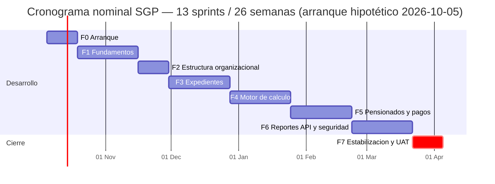
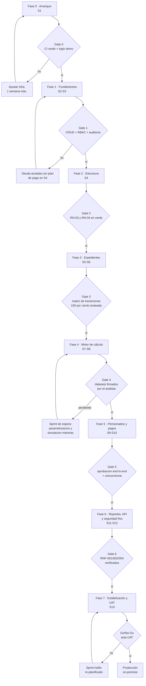

# Plan de Desarrollo por Fases — Sistema de Gestión de Pensionados (SGP)

| Campo | Valor |
|---|---|
| Proyecto | Sistema de Gestión de Pensionados (SGP) |
| Cliente | Ministerio de Trabajo (Cuba) |
| Documento | Plan de Desarrollo por Fases — Implementación del Backend |
| Versión | 1.0 |
| Fecha | 2026-09-26 |
| Estado | Borrador para aprobación del equipo |
| Documentos relacionados | `Requisitos funcionales.md` (RF/RNF/RN) · `Diseño de arquitectura.md` (módulos, TDD, ADR) · `Modelo de datos.md` (35 tablas, migraciones) |
| Alcance | Implementación completa del backend Laravel + MySQL hasta go-live |

---

## 1. Propósito y uso del plan

Este documento expande la sección 15 de `Diseño de arquitectura.md` en un **plan de ejecución operativo**: define, fase por fase y sprint por sprint, qué se construye, en qué orden, con qué dependencias, qué entregables se verifican y qué criterios objetivos permiten declarar cada etapa como terminada. No sustituye a los requisitos ni a la arquitectura: es el puente entre ambos y el código. Cualquier desviación detectada durante la ejecución se registra primero aquí (sección 11, gestión de cambios) y luego se refleja en los documentos fuente, para que la documentación viva nunca diverja del sistema real.

El plan está diseñado para **implementación incremental vertical**: cada fase entrega software funcionando y verificable en staging, nunca capas horizontales inconexas (p. ej., "todas las migraciones primero"). Este enfoque reduce el riesgo de integración tardía, permite validación funcional temprana con el analista del Ministerio y genera demos de fin de sprint con valor real desde el sprint 2. La estimación total es de **13 sprints de 2 semanas (26 semanas calendario)**, con un colchón implícito del ~15 % ya absorbido en la duración de cada fase.

### 1.1 Reglas de paso entre fases (gates)

Cada fase termina en un **gate de salida**: una lista de condiciones objetivas y verificables. Una fase no se considera cerrada —ni la siguiente puede iniciar su diseño detallado— hasta que todas las condiciones del gate se cumplen y quedan registradas. Si un gate no se supera, se activa el protocolo de la sección 11.3 (bloqueo y re-planificación), no se "arrastra deuda" silenciosamente. Las decisiones de re-planificación que afecten alcance, fechas o coste se documentan como entradas en la sección 11.2 y, si alteran decisiones arquitectónicas, generan un ADR nuevo en `Diseño de arquitectura.md`.

### 1.2 Convenciones de este documento

- **RF-XXX-NNN**, **RNF-NNN**, **RN-NNN** y **P-NN** referencian los artefactos de `Requisitos funcionales.md`.
- Cada fase usa una plantilla fija: objetivo · precondiciones (gate de entrada) · alcance funcional · tareas por sprint · entregables · Definition of Done (DoD) · gate de salida · riesgos.
- Las prioridades heredadas de requisitos son **M** (Must, bloqueante de go-live), **S** (Should, importante pero aplazable) y **C** (Could, opcional/propuesta).
- Las fechas del cronograma son **nominales**: se calculan desde una fecha de arranque hipotética (lunes 2026-10-05) y se recalculan al aprobarse el kickoff real.

## 2. Lineamientos transversales de ejecución

Estas reglas aplican a todas las fases y son condiciones permanentes del proyecto; su incumplimiento bloquea el merge del PR correspondiente, con independencia de la fase.

**Stack y estructura.** Laravel 12 sobre PHP 8.3 y MySQL 8.4 LTS, monolito modular con 12 módulos y capas Domain/Application/Infrastructure/Presentation por módulo (secciones 3-5 de `Diseño de arquitectura.md`). Las fronteras entre módulos se verifican con **deptrac** en cada PR (ADR-10): una dependencia no autorizada rompe el pipeline igual que un test en rojo. El dinero es siempre `DECIMAL(12,2)` (RN-005, RNF-008) y toda clave natural única se garantiza con constraint de base de datos (RN-008).

**Metodología de desarrollo.** TDD estricto conforme a la sección 12 de la arquitectura: Red-Green-Refactor en dominio y aplicación; datasets declarativos de Pest 3 para reglas tabulares (transiciones de estado, cálculo de pensiones); tests feature siempre contra MySQL 8.4 real, nunca SQLite (ADR-08). Cobertura mínima: ≥ 90 % en dominio/aplicación y ≥ 80 % global, verificada en CI con umbrales fallidos que rompen el build (RNF-007). PHPStan nivel 8 sin errores y Pint como formateador único.

**Control de versiones.** Conventional Commits (`feat:`, `fix:`, `refactor:`, `docs:`, `test:`); ramas efímeras `feat/SGP-<issue>` con vida máxima de 3 días; merge a `main` solo con PR aprobado por el CODEOWNER del módulo afectado y pipeline verde completo (Pint → PHPStan → deptrac → unitarios → feature+BD → cobertura → build Docker). `main` despliega automáticamente a staging; producción requiere tag anotado y aprobación manual registrada.

**Roles del equipo (referencia para estimación).** 1 tech lead/arquitecto al 50 % de dedicación, 2-3 desarrolladores backend a tiempo completo, 1 QA con foco en datasets y pruebas de carga, y 1 analista funcional del Ministerio como validador (imprescindible en fases 1, 4 y 7). La ausencia del analista en sus semanas críticas es un riesgo gestionado (sección 11.4).

**Calidad funcional continua.** Al cierre de cada sprint hay demo en staging contra datos sembrados de Cuba y revisión de la checklist de RFs tocados en el sprint. Ningún RF se marca como cubierto en la matriz de trazabilidad (sección 12) sin sus tests correspondientes en verde y validación funcional en la demo donde aplique.

## 3. Visión general del plan

| Fase | Sprints | Semanas | Módulos Laravel | RF principales | Resultado verificable |
|---|---|---|---|---|---|
| 0. Arranque | 1 (S1) | 2 | Shared (esqueleto) | RF-SEG-001 parcial | Pipeline CI verde; login demo en staging |
| 1. Fundamentos | 2 (S2-S3) | 4 | Catalogs, Settings, People, Security | RF-CAT, RF-PER, RF-SEG-002/003/004, RF-AUD-001/003/004 | CRUD de catálogos y personas en staging; seeders idempotentes |
| 2. Estructura organizacional | 1 (S4) | 2 | Organizations, LegalBasis | RF-ENT, RF-LEG | Jerarquías y coherencia geográfica probadas (RN-03/RN-04) |
| 3. Expedientes | 2 (S5-S6) | 4 | PensionCases | RF-EXP-001..011, RF-AUD-002 | Flujo completo submitted→approved/rejected sin pensionado |
| 4. Motor de cálculo | 2 (S7-S8) | 4 | PensionCalculation | RF-CAL-001..008 | Cálculo end-to-end con datasets firmados por el analista |
| 5. Pensionados y pagos | 2 (S9-S10) | 4 | Pensioners, Payments | RF-PEN, RF-PAG | Aprobación end-to-end con control bancario y nómina |
| 6. Reportes, API y seguridad fina | 2 (S11-S12) | 4 | Reporting, API pública | RF-REP, RF-API | Reportes con volúmenes objetivo ≤ RNF-002; hardening |
| 7. Estabilización y UAT | 1 (S13) | 2 | transversal | RNF completos | Acta UAT firmada; go-live aprobado |

El paso entre fases está gobernado por gates; el siguiente diagrama resume la cadena de decisiones y las salidas de contingencia cuando un gate no se supera:

**Principio de contingencia clave (Gate 4):** si el analista del Ministerio no ha firmado los datasets de cálculo al cierre de la fase 4, el equipo NO espera pasivamente: trabaja la parametrización, la simulación (RF-CAL-006) y adelanta tareas de la fase 5 que no dependan de la cuantía final (control bancario, secuencias). El gate se re-evalúa semanalmente hasta cerrarse.

---

## 4. Fase 0 — Arranque e infraestructura

**Sprint 1 · Semanas 1-2 · Módulos: Shared (esqueleto), infraestructura CI/CD**

### 4.1 Objetivo

Levantar los cimientos técnicos que harán verificable todo lo demás: repositorio con reglas de contribución, entorno Docker reproducible, pipeline de CI completo y el esqueleto modular de Laravel 12 con autenticación funcional. Al terminar la fase, cualquier desarrollador nuevo debe poder clonar el repositorio, ejecutar `docker compose up` y tener el sistema corriendo con login en menos de 30 minutos.

### 4.2 Precondiciones (gate de entrada)

- [x] Repositorio GitHub creado con acceso para todo el equipo (ya existente: `inass_siss`).
- [ ] Analista funcional del Ministerio designado y con disponibilidad agendada para las demos.
- [ ] Decisión de infraestructura de staging confirmada (VM accesible o servidor local del Ministerio).

### 4.3 Tareas del sprint

**Infraestructura y automatización (S1.1-S1.2)**
- [ ] `docker-compose.yml` con los servicios de la sección 14 de arquitectura: `app` (PHP 8.3-FPM), `web` (Nginx), `db` (MySQL 8.4 con volumen persistente), `queue` y `scheduler`.
- [ ] `Makefile` o scripts `composer` para comandos frecuentes: `make up`, `make test`, `make seed`, `make stan`.
- [ ] Imagen Docker de la aplicación con build reproducible en CI (multi-stage, sin dev-deps en runtime).
- [ ] Entorno `staging` desplegado con deploy automático desde `main` y healthcheck `/up` sondeado.

**Calidad desde el commit 1 (S1.3)**
- [ ] Pipeline GitHub Actions por PR: Pint → PHPStan nivel 8 → deptrac → Pest (unitarios + feature contra servicio MySQL 8.4 efímero) → umbrales de cobertura (90/80) → build de imagen.
- [ ] Configuración inicial de `deptrac.yaml` con las 12 módulos y sus dependencias autorizadas (tabla de la sección 4 de arquitectura).
- [ ] Protección de rama `main`: PR obligatorio, CODEOWNERS por módulo, squash-merge, verificación de estado requerida.
- [ ] Plantillas de PR e issue, `CHANGELOG.md` inicial, `CONTRIBUTING.md` con las convenciones del proyecto.

**Esqueleto de aplicación (S1.4-S1.5)**
- [ ] Bootstrap Laravel 12 con estructura `app/Modules/<Módulo>/{Domain,Application,Infrastructure,Presentation,Tests}` y `Providers/` de registro por módulo.
- [ ] Módulo `Shared` con los contratos núcleo: `ClockInterface`, `SequenceGeneratorInterface`, `TransactionManager`.
- [ ] Value objects base con sus tests: `Money` (inmutabilidad, redondeo bancario, rechazo de float), `CubanIdentityNumber` (validación completa de RN-001: 11 dígitos + dígito verificador + siglo/sexo), `Period` (RN-006: fin ≥ inicio).
- [ ] Login funcional con credenciales de demo (RF-SEG-001 en modo esqueleto; el hardening llega en fase 6), rate limiting básico de autenticación activado.
- [ ] Seeder de usuario administrador inicial idempotente.

### 4.4 Entregables

Pipeline CI/CD operativo; entorno local reproducible vía Docker; esqueleto modular con `Shared` completo; login demo en staging; documentos de gobernanza del repositorio (CONTRIBUTING, CODEOWNERS, CHANGELOG).

### 4.5 Definition of Done

- [ ] Un PR de prueba ("prueba del pipeline") recorre el flujo completo en verde: Pint, PHPStan 8, deptrac, Pest contra MySQL real, cobertura y build.
- [ ] `docker compose up` + `make seed` deja el sistema con login funcional en local, verificado por 2 desarrolladores distintos.
- [ ] La cobertura de `Shared` es ≥ 95 % (es el módulo más reutilizado del sistema).
- [ ] deptrac falla si se crea una dependencia no autorizada (probado deliberadamente en una rama de prueba).
- [ ] Staging despliega automáticamente desde `main` y `/up` responde 200.

### 4.6 Gate de salida

1. Pipeline verde desde el primer PR funcional.
2. Login demo operativo en staging.
3. Estructura modular y contratos `Shared` aprobados por el tech lead.

### 4.7 Riesgos de la fase

| Riesgo | Mitigación |
|---|---|
| Staging sin VM del Ministerio disponible | Arrancar staging en cloud privado del integrador; migración de entorno documentada y ensayada |
| Fricción con MySQL 8.4 en CI (imágenes, collation) | Contenedor de CI fijado a la misma versión menor que producción; prueba hecha en el propio sprint |

---

## 5. Fase 1 — Fundamentos: catálogos, configuración y personas

**Sprints 2-3 · Semanas 3-6 · Módulos: Catalogs, Settings, People, Security**

### 5.1 Objetivo

Construir la base de datos maestros sobre la que descansan expedientes y cálculo: catálogos simples y geográficos, configuración general versionada, secuencias de numeración, personas con su ciclo de vida, y el andamiaje transversal de seguridad (RBAC) y auditoría. Es la fase con más "madera oculta" del proyecto: todo lo que aquí quede flojo se pagará con intereses en las fases 3-5.

### 5.2 Precondiciones (gate de entrada)

- [ ] Gate 0 superado y registrado.
- [ ] Listas oficiales preliminares de catálogos entregadas por el analista (razas, niveles educacionales, categorías ocupacionales, tipos de pensión, regímenes). Si llegan incompletas: se siembran las conocidas y se registran huecos como `P-06` (los seeders son versionables y ajustables sin migraciones).

### 5.3 Alcance funcional

| Módulo | Requisitos | Notas |
|---|---|---|
| Catalogs | RF-CAT-001..004 (M), RF-CAT-006 (S) | CRUD de catálogos, municipios, agencias; carga inicial |
| Settings | RF-CAT-005 (M) + soporte a RF-PAG-006 | Configuración versionada `effective_from` + `numbering_sequences` |
| People | RF-PER-001..004 (M), RF-PER-005 (S) | Ciclo de vida de personas, duplicados |
| Security | RF-SEG-002, RF-SEG-003, RF-SEG-004 (M) | RBAC, restricción por estado, usuario↔persona |
| Auditoría | RF-AUD-001, RF-AUD-003, RF-AUD-004 (M) | Bitácora, consulta, borrado lógico |

### 5.4 Tareas por sprint

**Sprint 2 — Catálogos y configuración (S2.1-S2.5)**
- [ ] Migraciones de catálogos simples y geográficos conforme al modelo de datos (provincias, municipios con unicidad compuesta código+provincia, agencias, organismos, clasificadores) con constraints únicos de RN-008.
- [ ] `CubaGeographySeeder` idempotente: 15 provincias y 168 municipios con verificación de conteo en test.
- [ ] CRUD API REST de catálogos: endpoints resource con validación de unicidad devuelta como error 422 semántico (RF-API-002 se aplica desde ahora como convención transversal).
- [ ] Tests feature de CRUD + tests de infraestructura: migraciones aplican limpias en BD vacía y seeders son re-ejecutables sin duplicar.
- [ ] Configuración general versionada: tabla `general_settings` con `effective_from`/`effective_to`, acción de dominio que resuelve la vigente a una fecha dada, constraint de no solapamiento de vigencias (RN-007). TDD: primero el dataset de solapamientos y vigencia, después la implementación.
- [ ] `numbering_sequences` + implementación MySQL de `SequenceGeneratorInterface` con bloqueo pesimista (`SELECT ... FOR UPDATE` dentro de transacción) y test de concurrencia real con 8 procesos paralelos sin huecos ni duplicados (RN-009). Este es un entregable de infraestructura que se consumirá en fases 3 y 5.

**Sprint 3 — Personas y seguridad (S3.1-S3.5)**
- [ ] Migración y dominio de `people`: alta, edición con auditoría de valores previos (RF-PER-002), registro de fallecimiento con fecha (RF-PER-003) y su efecto en búsquedas.
- [ ] Validador de identidad cubano aplicado en dominio y como regla de Request; unicidad de identidad garantizada por constraint de BD (RN-001).
- [ ] Búsqueda de personas por identidad, nombre aproximado y filtros básicos, paginada (RF-PER-004); control de duplicados al alta con aviso confirmable (RF-PER-005).
- [ ] Usuarios + RBAC con spatie/laravel-permission (ADR-05): roles y permisos iniciales del análisis (sección 2.2 de requisitos), matriz rol-permiso como dataset de Pest (anticipa la matriz completa de la fase 6).
- [ ] Asociación usuario↔persona con unicidad (RF-SEG-004) y restricción de acciones por estado de persona (RF-SEG-003: p. ej., persona fallecida no puede iniciar expediente).
- [ ] Auditoría base con spatie/laravel-activitylog + observers propios: bitácora de toda escritura con valores previos (RF-AUD-001, RNF-005), consulta filtrable de bitácoras para roles autorizados (RF-AUD-003), borrado lógico con restauración auditada (RF-AUD-004).

### 5.5 Entregables

API de catálogos con datos oficiales sembrados; configuración versionada con resolución de vigencia; generador de secuencias concurrencia-seguro; ciclo de vida de personas completo; RBAC con matriz testeada; bitácora de auditoría transversal operativa.

### 5.6 Definition of Done

- [ ] CRUD de catálogos y personas demostrable en staging con datos de Cuba.
- [ ] Seeders idempotentes probados (re-ejecución no duplica ni falla).
- [ ] Test de concurrencia de secuencias en verde con evidencia adjunta al PR.
- [ ] Toda escritura de personas y catálogos genera bitácora con autor, fecha y valores previos (verificado con feature test).
- [ ] Cobertura ≥ 90 % en dominio de People/Settings; ≥ 80 % global.
- [ ] Demo de fin de fase con el analista: catálogos revisados y huecos de `P-06` registrados.

### 5.7 Gate de salida

1. CRUD de catálogos y personas en staging con suite verde.
2. RBAC y auditoría base operativos.
3. Configuración versionada y secuencias disponibles para consumo de fases posteriores.

### 5.8 Riesgos de la fase

| Riesgo | Mitigación |
|---|---|
| Listas de catálogos oficiales incompletas (P-06) | Seeders versionables; sembrar lo conocido; los vacíos no bloquean (P-06 documentado) |
| Complejidad latente de vigencias (solapamientos) | Regla resuelta por TDD antes de exponer API; constraint en BD como última línea |

---

## 6. Fase 2 — Estructura organizacional y base legal

**Sprint 4 · Semanas 7-8 · Módulos: Organizations, LegalBasis**

### 6.1 Objetivo

Modelar el mapa organizacional del Estado que interviene en cada expediente: entidades con jerarquías acíclicas, oficinas geográficamente coherentes, cargos y firmas autorizadas; y el corpus de base legal que respalda cada resolución de pensión.

### 6.2 Precondiciones (gate de entrada)

- [ ] Gate 1 superado y registrado.
- [ ] Estructura organizacional real (organismos, entidades, oficinas territoriales) disponible en formato consultable.

### 6.3 Alcance funcional

| Módulo | Requisitos | Notas |
|---|---|---|
| Organizations | RF-ENT-001..004 (M), RF-ENT-005 (S) | Entidades, oficinas, firmas, coherencia |
| LegalBasis | RF-LEG-001..003 (M), RF-LEG-004 (S) | Tipos, bases, vigencias |

### 6.4 Tareas del sprint

**Estructura organizacional (S4.1-S4.3)**
- [ ] Migraciones y dominio de entidades y oficinas con jerarquías auto-referenciadas.
- [ ] Regla de aciclicidad como test de dominio puro (RN-03): dataset con árboles válidos e inválidos; el algoritmo de detección de ciclos se implementa en `Domain`, no en BD, y se ejecuta antes de persistir.
- [ ] Coherencia geográfica (RN-04, RF-ENT-004): toda entidad/oficina con provincia exige municipio perteneciente; validación en dominio + constraint compuesto en BD.
- [ ] Cargos y firmas autorizadas por entidad (RF-ENT-003): unicidad activa de firma (persona+cargo+entidad), historial de revocación.
- [ ] Consulta de estructura (RF-ENT-005): árbol de jerarquía paginado y búsqueda por nombre/NIT.

**Base legal (S4.4-S4.5)**
- [ ] Tipos de base legal (catálogo sembrado) y registro de bases legales con organismo emisor, número, fecha y texto referencia.
- [ ] Control de vigencias legales (RF-LEG-003, RN-006): `effective_from` ≤ `effective_to`, resolución de bases vigentes a una fecha.
- [ ] Consulta documental filtrable (RF-LEG-004).

### 6.5 Entregables

API de entidades/oficinas/firmas con reglas estructurales inviolables; corpus de bases legales con control de vigencia; tests de aciclicidad y coherencia geográfica como activos permanentes de regresión.

### 6.6 Definition of Done

- [ ] Tests de dominio de aciclicidad (RN-03) y coherencia (RN-04) en verde con datasets documentados.
- [ ] Carga de estructura organizacional real demostrada en staging.
- [ ] Una base legal puede crearse, caducar y consultarse como vigente/no vigente según fecha de corte.
- [ ] deptrac sigue en verde: Organizations solo depende de Shared/Catalogs/People.

### 6.7 Gate de salida

1. Jerarquías y coherencia geográfica probadas (RN-03/RN-04).
2. Bases legales con vigencias operativas.

### 6.8 Riesgos de la fase

| Riesgo | Mitigación |
|---|---|
| Estructura org. real con duplicidades o datos sucios | Importación validada con reporte de rechazos; corrección con el analista, no en código |

---

## 7. Fase 3 — Expedientes y flujo de resolución

**Sprints 5-6 · Semanas 9-12 · Módulos: PensionCases**

### 7.1 Objetivo

Construir el corazón administrativo del sistema: el expediente de pensión con sus subregistros (salarios, servicios, ciclos de trabajo), su máquina de estados completa y su historial inmutable. Al cierre, un expediente debe poder nacer, completarse, revisarse, aprobarse o denegarse —sin generar aún pensionado— con evidencia auditable de cada transición.

### 7.2 Precondiciones (gate de entrada)

- [ ] Gate 2 superado y registrado.
- [ ] RF-EXP-001..011 revisados con el analista: campos del expediente y evidencias exigibles por transición (nota, base legal).

### 7.3 Alcance funcional

| Módulo | Requisitos | Notas |
|---|---|---|
| PensionCases | RF-EXP-001..008, RF-EXP-011 (M); RF-EXP-009 (M); RF-EXP-010 (S) | Expediente, subregistros, estados, historial, búsquedas |
| Auditoría | RF-AUD-002 (M) | Historial de estados como bitácora especializada |

### 7.4 Tareas por sprint

**Sprint 5 — Expediente y subregistros (S5.1-S5.5)**
- [ ] Migraciones del bloque PensionCases conforme al modelo de datos: `pension_cases`, `salary_records`, `service_records` (con marcador coletilla), `work_cycles`, relación única expediente↔persona (corrección H-02).
- [ ] Creación del expediente (RF-EXP-001): número generado vía `SequenceGeneratorInterface` (consumo del entregable de fase 1), persona viva, oficina y régimen válidos, constraint único de expediente abierto por persona.
- [ ] Subregistros con validaciones RN-005/RN-006 (importes `DECIMAL(12,2)`, periodos coherentes) y solapamiento de servicios detectado y advertido.
- [ ] API de subregistros con altas/bajas dentro del expediente en estados editables únicamente (borrador/submitted).
- [ ] Feature tests transaccionales: creación de expediente con subregistros atómica (todo o nada).

**Sprint 6 — Máquina de estados, historial y búsqueda (S6.1-S6.5)**
- [ ] Enum respaldado de estados `CaseStatus` con transiciones codificadas primero como **dataset de Pest** (la matriz completa de la sección 2.4 de requisitos): cada fila es un caso transición-permitida o transición-rechazada con su error esperado. La máquina de estados nace de ese dataset (estrategia TDD de la sección 15.2 de arquitectura).
- [ ] Transiciones como subrecurso POST (ADR-07): `POST /pension-cases/{id}/submit`, `/review`, `/approve`, `/reject`, cada uno con su evidencia exigible (nota, base legal vigente en approval/denial).
- [ ] Revisión con validación de completitud (RF-EXP-006): checklist de datos mínimos que bloquea el avance si falta.
- [ ] Denegación (RF-EXP-008) con base legal obligatoria; reapertura administrativa (RF-EXP-010) solo para rol Administrador, con motivo y bloqueo derivado.
- [ ] Historial de estados append-only (RF-EXP-009, RF-AUD-002): tabla de transiciones con estado previo/nuevo, usuario, fecha, nota; inmutable y consultable por roles de auditoría.
- [ ] Búsqueda y filtros (RF-EXP-011): por estado, oficina, persona, rango de fechas y número, con índices compuestos y paginación estricta; exportación CSV delegada a fase 6 (se registra la dependencia).

### 7.5 Entregables

Flujo completo de expediente en staging: `draft → submitted → under_review → approved/rejected` (+ reapertura) con número secuencial, subregistros validados, historial inmutable y búsquedas operativas; matriz de transiciones 100 % testeada como activo de regresión permanente.

### 7.6 Definition of Done

- [ ] La suite de la matriz de transiciones cubre el 100 % de celdas de la matriz (permitidas y prohibidas) sin excepciones.
- [ ] Dos aprobaciones concurrentes del mismo expediente no pueden ocurrir (test de carrera con transacción/lock).
- [ ] Toda transición deja fila en historial; intentar mutar historial falla en test de inmutabilidad.
- [ ] El número de expediente es único, secuencial y sin huecos bajo concurrencia (reuso del test de fases 1).
- [ ] Cobertura ≥ 90 % en dominio de PensionCases.
- [ ] Demo con el analista: expediente completo de prueba caminado por los 5 estados.

### 7.7 Gate de salida

1. Flujo submitted→rejected/approved (sin pensionado) con matriz de transiciones 100 % testeada.
2. Historial de estados operativo e inmutable.
3. Búsquedas de expedientes con rendimiento razonable en volumen sembrado (~50k expedientes sintéticos).

### 7.8 Riesgos de la fase

| Riesgo | Mitigación |
|---|---|
| Descubrimiento de estados/transiciones no previstos al validar con el analista | La matriz es un dataset declarativo: agregar una fila + ajustar el enum es un cambio local y barato |
| Rendimiento de búsquedas con datos sintéticos | Seeders de volumen desde ya; EXPLAIN en el DoD; índices compuestos por diseño del modelo |

---

## 8. Fase 4 — Motor de cálculo de pensiones

**Sprints 7-8 · Semanas 13-16 · Módulos: PensionCalculation**

### 8.1 Objetivo

Implementar el dominio financiero del sistema: verificación de elegibilidad, cómputo de años de servicio, salario promedio y cuantía con topes e incrementos, con estrategias por régimen, simulación sin persistencia y persistencia congelada de resultados. Es el corazón TDD del proyecto (sección 15.2 de arquitectura): cada regla de cálculo existe primero como dataset firmado.

### 8.2 Precondiciones (gate de entrada)

- [ ] Gate 3 superado y registrado.
- [ ] Datasets de cálculo elaborados por el equipo y **pendientes de firma** por el analista (P-01..P-03). El gate de salida exige la firma; el trabajo no se detiene mientras tanto (regla de contingencia de la sección 3).

### 8.3 Alcance funcional

| Módulo | Requisitos | Notas |
|---|---|---|
| PensionCalculation | RF-CAL-001..004, RF-CAL-006, RF-CAL-007, RF-CAL-008 (M); RF-CAL-005 (S) | Elegibilidad, servicio, promedio, cuantía, simulación, trazabilidad |

### 8.4 Tareas por sprint

**Sprint 7 — Elegibilidad, servicio y promedio (S7.1-S7.5)**
- [ ] `EligibilityChecker` por TDD (RF-CAL-001): edad mínima por sexo y años mínimos contra configuración vigente a la fecha de solicitud; resultado booleano por criterio con explicación legible (dataset: casos borde de cumpleaños y años justos).
- [ ] Cómputo de años de servicio (RF-CAL-002, corrección H-15): sumatoria de intervalos de `service_records` (abierto = hasta Clock fijo), conversión de `work_cycles` con meses-por-año del régimen, integración de coletilla conforme al parámetro del régimen (P-03 parametrizado).
- [ ] Salario promedio (RF-CAL-003) con `Money` y redondeo bancario; política de selección de años como estrategia intercambiable (P-01: todos / últimos N / mejores N) seleccionable por configuración del régimen.
- [ ] Test de contrato compartido entre políticas de promedio (Liskov): mismo dataset de entrada produce resultados documentados por política.
- [ ] Conceptos de ingreso (RF-CAL-005, S): los conceptos marcados `aplica_salario_base` participan del salario base de referencia, como invariante testeable.

**Sprint 8 — Cuantía, simulación y persistencia congelada (S8.1-S8.5)**
- [ ] Cuantía base (RF-CAL-004) por TDD: cuantía = promedio × (base + incremento × años excedentes), topeada por máximo; todo parámetro desde `general_settings` vigente, jamás hardcodeado. Datasets con topes exactos, excedentes cero y valores límite.
- [ ] `RegimeCalculationStrategyInterface` + estrategias por régimen con test de contrato común (misma interfaz, mismos datasets base + específicos por régimen).
- [ ] Simulación sin persistencia (RF-CAL-006): `PreviewCalculationAction` para expedientes en submitted/under_review que devuelve elegibilidad, años, promedio, cuantía y advertencias sin escribir resultados.
- [ ] Persistencia del cálculo al aprobar (RF-CAL-007): cuantía, parámetros usados, **versión de configuración** y usuario en la misma transacción que la aprobación; el expediente aprobado congela inmutable su cálculo.
- [ ] Trazabilidad del motor (RF-CAL-008, RNF-010): cada ejecución persistente guarda entradas + versión de `general_settings`; test de re-ejecución histórica reproduce exactamente la cuantía original (dataset congelado).
- [ ] Infection (mutación) ejecutado sobre el paquete de cálculo: score mínimo acordado (≥ 80 % en dominio de cálculo) como termómetro de la calidad de la suite (sección 12.4 de arquitectura).

### 8.5 Entregables

Motor de cálculo completo con estrategias por régimen; simulación operativa en staging; persistencia congelada y reproducible; datasets de cálculo firmados por el analista como artefacto de aceptación versionado en el repositorio.

### 8.6 Definition of Done

- [ ] Todos los datasets de cálculo (elegibilidad, servicio, promedio, cuantía, re-ejecución histórica) en verde y firmados por el analista.
- [ ] Las tres políticas de promedio (P-01) implementadas y seleccionables por régimen, con la elegida por defecto documentada.
- [ ] La simulación no escribe absolutamente nada (verificado por test de transacción vacía).
- [ ] Un expediente aprobado con configuración antigua recalcula hoy y produce la cuantía original exacta (test de RNF-010).
- [ ] Cobertura ≥ 95 % en dominio de PensionCalculation (estándar reforzado por criticidad financiera).
- [ ] Ningún literal numérico de política de pensión en el código (revisión de PR explícita de este punto; parámetros solo desde Settings).

### 8.7 Gate de salida

1. Cálculo end-to-end demostrado con datasets aprobados por el analista.
2. Trazabilidad RF-CAL-008 verificada: re-ejecución histórica reproduce resultados.
3. Simulación disponible para uso en revisión de expedientes.

### 8.8 Riesgos de la fase

| Riesgo | Mitigación |
|---|---|
| Ambigüedad de reglas de cálculo (P-01..P-03) | Parametrización + validación temprana con datasets firmados; sprint de contingencia definido |
| Errores financieros silenciosos | Infection sobre cálculo; `Money` inmutable; revisión cruzada obligatoria de todo PR del paquete |

---

## 9. Fase 5 — Pensionados y pagos

**Sprints 9-10 · Semanas 17-20 · Módulos: Pensioners, Payments**

### 9.1 Objetivo

Cerrar el ciclo de negocio: la aprobación de un expediente genera el pensionado (atómicamente), el pensionado recibe control bancario con número de secuencia único, y la nómina electrónica se exporta por agencia. Se añade el registro de pagos periódicos como propuesta controlada (RF-PAG-005, C, pendiente de validación funcional H-16).

### 9.2 Precondiciones (gate de entrada)

- [ ] Gate 4 superado (datasets firmados) — requisito para las tareas dependientes de cuantía.
- [ ] Formatos de nómina por agencia recabados (P-05); si no están, la exportación se construye con plantilla configurable y una agencia piloto.

### 9.3 Alcance funcional

| Módulo | Requisitos | Notas |
|---|---|---|
| Pensioners | RF-PEN-001..003 (M), RF-PEN-004 (S) | Alta atómica, ficha, ciclo de vida, reclasificación |
| Payments | RF-PAG-001..003, RF-PAG-006 (M), RF-PAG-004 (S), RF-PAG-005 (C) | Control bancario, catálogos, secuencias, nómina, pagos (propuesta) |

### 9.4 Tareas por sprint

**Sprint 9 — Pensionados (S9.1-S9.4)**
- [ ] Alta automática desde aprobación (RF-PEN-001, corrección H-04): en la MISMA transacción que la aprobación se crea el pensionado con persona, tipo y régimen de pensión y cuantía calculada; referencia única al expediente de origen (`origin_case_id`); fallo si la persona ya tiene pensionado activo.
- [ ] Feature test transaccional end-to-end: aprobar expediente → verificar pensionado creado con exactamente la cuantía congelada; rollback simulado no deja pensionado huérfano.
- [ ] Ficha del pensionado (RF-PEN-002): datos de persona, tipo/régimen, cuantía, expediente de origen, historial y controles bancarios; listados filtrables por provincia, tipo, régimen y estado.
- [ ] Ciclo de vida de la pensión (RF-PEN-003): suspensión, reanudación, extinción (fallecimiento enlaza con RF-PER-003) con transiciones auditadas; reclasificación (RF-PEN-004, S) con nuevo cálculo versionado.

**Sprint 10 — Control bancario y nómina (S10.1-S10.5)**
- [ ] Catálogos del pago (RF-PAG-003): tipos de pago, formas, estados según modelo de datos.
- [ ] Registro de control bancario (RF-PAG-001): agencia, número de control generado vía `numbering_sequences` con **bloqueo pesimista** (corrección H-06/RF-PAG-006); unicidad garantizada por constraint de BD.
- [ ] Asignación al pensionado (RF-PAG-002): un control activo por pensionado, historial de reasignaciones auditado.
- [ ] Test de concurrencia real de secuencias de control bancario: N procesos paralelos generando controles sin duplicados ni huecos, con medición de tiempo de espera (riesgo de contención de la sección 15.3 de arquitectura).
- [ ] Exportación de nómina electrónica (RF-PAG-004): por agencia y período, en cola (`queue`), con plantilla de formato configurable por agencia (P-05) y archivo de verificación de conteo.
- [ ] Pagos periódicos (RF-PAG-005, C — propuesta H-16): implementación mínima controlada detrás de feature flag, marcada "pendiente de validación funcional" en la documentación viva; no bloquea el gate.

### 9.5 Entregables

Ciclo completo expediente→pensionado→control bancario→nómina en staging; secuencias bancarias a prueba de concurrencia; exportación de nómina con plantillas por agencia; esqueleto de pagos periódicos acotado.

### 9.6 Definition of Done

- [ ] La aprobación end-to-end (expediente completo → pensionado con control bancario) funciona en staging con la suite de integración en verde.
- [ ] Test de concurrencia de secuencias bancarias en verde con evidencia de tiempos.
- [ ] La nómina exportada pasa validación de conteo y suma contra la BD (archivo de control).
- [ ] RF-PAG-005 claramente señalizado como propuesta en código y documentación.
- [ ] Cobertura ≥ 90 % en dominio de Pensioners/Payments.

### 9.7 Gate de salida

1. Aprobación end-to-end con control bancario demostrada.
2. Concurrencia de secuencias testeada y monitoreada.
3. Nómina electrónica exportada para la agencia piloto.

### 9.8 Riesgos de la fase

| Riesgo | Mitigación |
|---|---|
| Contención de la secuencia de control bancario | Bloqueo pesimista + tests de concurrencia real + monitoreo de espera; alternativa de rango reservado documentada si el tiempo de espera supera el umbral |
| Formato de nómina desconocido (P-05) | Plantillas configurables + agencia piloto; el formato no bloquea el resto del módulo |

---

## 10. Fase 6 — Reportes, API completa y seguridad fina

**Sprints 11-12 · Semanas 21-24 · Módulos: Reporting + endurecimiento transversal**

### 10.1 Objetivo

Elevar el sistema funcional a plataforma auditable y de alto rendimiento: reportes estadísticos con exportaciones, documentación OpenAPI completa de la API, y el endurecimiento de seguridad (políticas por rol y territorio, bloqueos, rate limiting integral). También es la fase de "pago de deudas menores": los RF tipo S aplazados se completan o se descartan explícitamente con registro.

### 10.2 Precondiciones (gate de entrada)

- [ ] Gate 5 superado y registrado.
- [ ] Volúmenes objetivo confirmados para pruebas de rendimiento (RNF-002: 500k personas, 200k expedientes) o el acuerdo del volumen real disponible.

### 10.3 Alcance funcional

| Módulo | Requisitos | Notas |
|---|---|---|
| Reporting | RF-REP-001, RF-REP-002, RF-REP-004 (M), RF-REP-003 (S), RF-REP-005 (C) | Reportes, exportaciones, tablero |
| API | RF-API-001..003 (M), RF-API-004 (S) | Versionado, convenciones, idempotencia, docs |
| Seguridad | refuerzo RF-SEG-001..004 + RNF-004 | Hardening OWASP, matriz de permisos completa |

### 10.4 Tareas por sprint

**Sprint 11 — Reportes y exportaciones (S11.1-S11.5)**
- [ ] Reportes de expedientes (RF-REP-001): por estado, oficina, período y régimen, agregados en SQL con índices compuestos; paginación estricta; reportes pesados en cola.
- [ ] Reportes de pensionados (RF-REP-002): activos/suspendidos/extintos por provincia y agencia; de pagos (RF-REP-003, S).
- [ ] Exportaciones CSV de listados filtrados (RF-REP-004, cierra la dependencia delegada desde fase 3): streaming para volúmenes grandes, en cola con notificación de finalización.
- [ ] Tablero de indicadores (RF-REP-005, C): versión mínima con contadores cacheados; se marca como ampliable post go-live.
- [ ] Pruebas de rendimiento preliminares de reportes sobre volumen sembrado; EXPLAIN de las 10 consultas más pesadas y ajuste de índices con evidencia.

**Sprint 12 — OpenAPI, idempotencia y hardening (S12.1-S12.6)**
- [ ] Documentación OpenAPI 3 generada desde el código (RF-API-004) y publicada internamente; validación de convenciones de respuesta (RF-API-002) en todos los endpoints.
- [ ] Idempotencia y concurrencia de API (RF-API-003): cabeceras `If-Match`/ETag o versión optimista en escrituras críticas; retry seguro de transiciones con Idempotency-Key.
- [ ] Matriz completa de permisos por rol (extensión del dataset de fase 1): cada endpoint × cada rol = permitido/denegado, testeada por Pest (miles de casos generados declarativamente).
- [ ] Ámbito territorial: usuarios de oficina solo ven/actúan sobre expedientes de su territorio (política de dominio, no filtro de UI).
- [ ] Hardening RNF-004: OWASP Top 10 revisado punto por punto (headers de seguridad, validación estricta de entrada, rate limiting por rol y endpoint, política de contraseñas, bloqueo por intentos).
- [ ] Revisión de seguridad interna (checklist en equipo + tech lead) con hallazgos registrados y corregidos; los no críticos pasan al backlog post go-live con severidad asignada.

### 10.5 Entregables

Reportes operativos con rendimiento medido; exportaciones robustas; OpenAPI publicada; matriz de permisos 100 % testeada; reporte de revisión de seguridad con hallazgos cerrados.

### 10.6 Definition of Done

- [ ] RNF-002 verificado: listados y reportes paginados ≤ 2 s (p95) sobre volúmenes objetivo en staging.
- [ ] La matriz de permisos cubre todos los endpoints publicados sin celdas sin test.
- [ ] OpenAPI refleja el 100 % de endpoints de `/api/v1` y pasa validación de esquema.
- [ ] Ningún hallazgo de seguridad crítico o alto abierto.
- [ ] RF-S aplazados completados o descartados con registro explícito en la matriz de trazabilidad.

### 10.7 Gate de salida

1. Reportes con volúmenes objetivo ≤ RNF-002 demostrado con evidencia.
2. Revisión de seguridad interna sin hallazgos críticos/altos abiertos.
3. API documentada y con convenciones uniformes verificadas.

### 10.8 Riesgos de la fase

| Riesgo | Mitigación |
|---|---|
| Rendimiento de reportes histórico/creciente | Índices compuestos por diseño, cola para pesados, caché de agregados del tablero |
| Explosión de casos de la matriz de permisos | Generación declarativa de casos (producto cartesiano rol×endpoint), no redacción manual |

---

## 11. Fase 7 — Estabilización, UAT y despliegue

**Sprint 13 · Semanas 25-26 · Módulos: transversal**

### 11.1 Objetivo

Demostrar que el sistema está listo para producción: verificación final de todos los RNF, prueba de carga formal, pruebas de aceptación con usuarios reales del Ministerio (UAT), manuales de operación y el plan de despliegue on-premise ejecutable. La fase termina con el acta UAT firmada y la decisión Go/No-Go.

### 11.2 Precondiciones (gate de entrada)

- [ ] Gate 6 superado y registrado.
- [ ] Usuarios UAT designados por el Ministerio (mínimo: 2 tramitadores, 1 revisor, 1 administrador, 1 auditor).
- [ ] Plan de migración de datos históricos acotado (P-07: si hay migración, es proyecto aparte; el go-live no la bloquea).

### 11.3 Tareas del sprint

**Verificación de RNF y carga (S13.1-S13.2)**
- [ ] Prueba de carga formal (RNF-001): 100 usuarios concurrentes, p95 ≤ 500 ms en APIs transaccionales, con reporte de resultados.
- [ ] Prueba de disponibilidad y observabilidad: healthcheck, logs estructurados con `request_id` correlacionable con bitácora, slow query log revisado.
- [ ] Simulacro de respaldo y restauración (RNF-009): dump diario + binlog, RPO ≤ 24 h / RTO ≤ 4 h cronometrados y documentados.

**UAT y cierre (S13.3-S13.5)**
- [ ] Guion de UAT por rol basado en los RF (recorridos completos: expediente de vida, cálculo, aprobación, nómina, auditoría).
- [ ] Ejecución de UAT con usuarios reales; hallazgos clasificados (bloqueante/menor) y los bloqueantes corregidos dentro del sprint o replanificados explícitamente.
- [ ] Manuales de operación: instalación on-premise (docker compose), respaldo/restauración, gestión de usuarios y roles, resolución de incidencias básicas.
- [ ] Plan de despliegue: checklist paso a paso, estrategia de rollback, verificación post-instalación.
- [ ] Reunión Go/No-Go con acta firmada por el Ministerio; en Go: despliegue a producción, tag `v1.0.0` y monitoreo intensivo la primera semana.

### 11.4 Entregables

Reportes de carga y restauración; guion y resultados de UAT; manuales de operación; plan de despliegue con rollback; acta UAT; producción desplegada (si Go).

### 11.5 Definition of Done

- [ ] RNF-001..010 verificados individualmente con evidencia archivada en el repositorio.
- [ ] Acta UAT firmada sin hallazgos bloqueantes abiertos.
- [ ] Simulacro de restauración ejecutado en el propio entorno de producción (o equivalente) dentro de los tiempos RPO/RTO.
- [ ] Manuales revisados por alguien ajeno a su redacción (prueba de "seguir los pasos tal cual").
- [ ] Tag `v1.0.0` y CHANGELOG de release publicado.

### 11.6 Gate de salida (final)

1. Acta UAT firmada.
2. RNF verificados.
3. Go-live aprobado y ejecutado con monitoreo de la primera semana sin incidentes críticos.

### 11.7 Riesgos de la fase

| Riesgo | Mitigación |
|---|---|
| Hallazgos bloqueantes de UAT tardíos | Guion de UAT ensayado en staging por el equipo antes de la sesión formal; presupuesto de corrección dentro del sprint |
| Infraestructura del Ministerio no lista | Plan de despliegue con checklist de prerrequisitos verificados 2 semanas antes; go-live diferido no penaliza el resto del sistema ya aceptado |
| Datos históricos sorpresivos (P-07) | Alcance de go-live sin migración; proyecto de migración aparte posterior |

---

## 12. Gobernanza del plan

### 12.1 Ceremonias y cadencia

Sprint de 2 semanas con: planning (primer día, 1 h), daily (15 min), review/demo al cierre con checklist de RFs tocados y participación del analista, y retrospective (30 min). Los gates de fase se revisan en la review del último sprint de cada fase y su superación se registra en el repositorio (carpeta `docs/gates/` con fecha, evidencias y firmante), quedando como actas verificables del avance.

### 12.2 Gestión de cambios de alcance

Todo cambio de alcance entra como issue etiquetado `scope-change` y se evalúa en weekly de control: si desplaza gates o fechas, se decide explícitamente entre aplazar (backlog por prioridad MoSCoW), sustituir (quitar equivalente) o ampliar (re-planificación formal con nueva fecha aprobada por el Ministerio). Ningún cambio entra "por la puerta de atrás": la matriz de trazabilidad (sección 13) es el espejo donde se refleja el alcance real en todo momento.

### 12.3 Bloqueos y re-planificación

Si un gate no se supera al cierre de su fase: (1) se documenta la causa raíz en `docs/gates/`; (2) se activa el plan de contingencia de la fase si existe (p. ej. Gate 4, sección 3); (3) si no existe, se convoca re-planificación dentro de las 48 h siguientes con decisión explícita: extender la fase (máximo +1 sprint), reducir su alcance (los RF-C/S pasan al backlog) o aceptar deuda con plan de pago fechado. Las tres opciones dejan rastro documentado.

### 12.4 Métricas de seguimiento

| Métrica | Umbral de alerta | Fuente |
|---|---|---|
| Velocidad del sprint (puntos) | -20 % frente a media de 3 sprints | Board del repositorio |
| Cobertura global / dominio | < 80 % / < 90 % | CI en cada PR |
| Deuda de gates abiertos | > 0 tras 1 semana de cierre nominal | `docs/gates/` |
| PRs abiertos > 3 días | > 20 % del total | Board del repositorio |
| Hallazgos de seguridad abiertos | cualquier crítico/alto | Revisión de fase 6 |
| RNF pendientes de verificar | > 3 en semana 24 | Checklist de fase 7 |

### 12.5 Gestión de riesgos global

La tabla de riesgos por fase (secciones 4.7 a 11.7) se consolida y re-evalúa en cada retrospective: probabilidad e impacto se recalifican, se añaden riesgos emergentes y se cierran los mitigados. El owner de cada riesgo es siempre una persona concreta, nunca "el equipo". Los riesgos de nivel Alto-Alto se reportan al Ministerio en la demo siguiente.

---

## 13. Matriz de trazabilidad del plan

### 13.1 Cobertura de RF por fase

| Fase | RF Must (M) | RF Should (S) | RF Could (C) |
|---|---|---|---|
| 0 | RF-SEG-001 (esqueleto) | — | — |
| 1 | RF-CAT-001..005, RF-PER-001..004, RF-SEG-002..004, RF-AUD-001/003/004 | RF-CAT-006, RF-PER-005 | — |
| 2 | RF-ENT-001..004, RF-LEG-001..003 | RF-ENT-005, RF-LEG-004 | — |
| 3 | RF-EXP-001..009, RF-EXP-011, RF-AUD-002 | RF-EXP-010 | — |
| 4 | RF-CAL-001..004, RF-CAL-006..008 | RF-CAL-005 | — |
| 5 | RF-PEN-001..003, RF-PAG-001..003, RF-PAG-006 | RF-PEN-004, RF-PAG-004 | RF-PAG-005 (propuesta H-16) |
| 6 | RF-REP-001/002/004, RF-API-001..003 | RF-REP-003, RF-API-004 | RF-REP-005 |
| 7 | (verificación integral) | — | — |

Los 66 RF del catálogo quedan asignados: 54 M (todos con fase), 10 S distribuidos y 2 C acotados con condición. Cualquier RF sin fase es un error de este plan que debe corregirse en la primera weekly de control.

### 13.2 Cobertura de RNF por fase

| RNF | Verificado en | Nota |
|---|---|---|
| RNF-001, RNF-002 | Fase 6 (preliminar) + Fase 7 (formal) | Pruebas de carga |
| RNF-003 | Fase 7 | Monitoreo de primera semana post go-live |
| RNF-004 | Fases 0 (básico) + 6 (completo) | Revisión OWASP |
| RNF-005 | Fase 1 | Bitácora transversal desde el primer CRUD |
| RNF-006 | Fase 7 | Despliegue limpio on-premise |
| RNF-007 | Fase 0 en adelante (continuo) | CI en cada PR |
| RNF-008 | Fases 1-4 (continuo) | Money + DECIMAL en cada migración |
| RNF-009 | Fase 7 (simulacro) | Respaldos configurados desde fase 0 |
| RNF-010 | Fase 4 | Re-ejecución histórica congelada |

### 13.3 Referencias cruzadas

- Requisitos, prioridades y preguntas abiertas: `Requisitos funcionales.md` (secciones 4-7).
- Módulos, capas, patrones, TDD y ADR: `Diseño de arquitectura.md` (secciones 3-16).
- Tablas, constraints, índices, migraciones y seeders: `Modelo de datos.md`.
- Este plan expande la sección 15 de `Diseño de arquitectura.md`; ante conflicto de criterio, prevalecen los ADR de arquitectura y las decisiones se reconcilian por gestión de cambios (sección 12.2 de este documento).

## 14. Control de versiones del documento

| Versión | Fecha | Cambios | Autor |
|---|---|---|---|
| 1.0 | 2026-09-26 | Versión inicial: 8 fases, 13 sprints, gates, DoD, trazabilidad completa | Arquitectura Backend |

