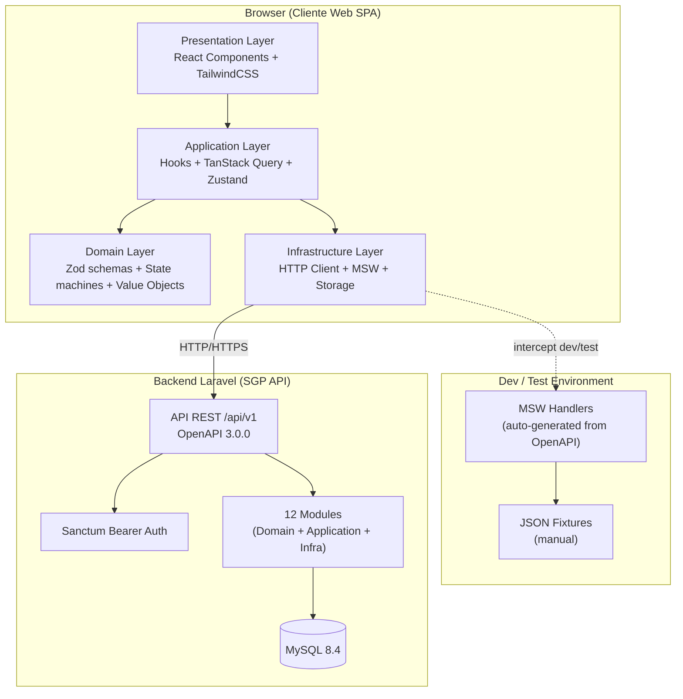
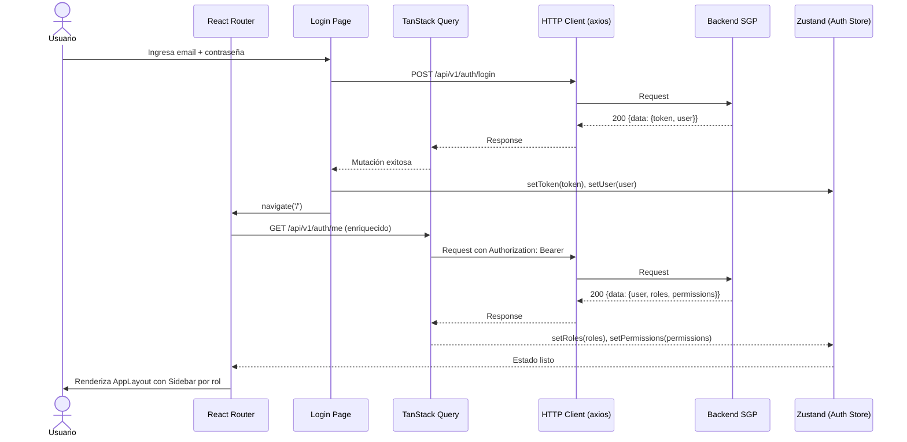
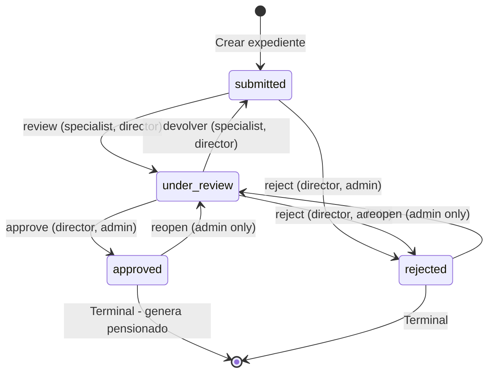
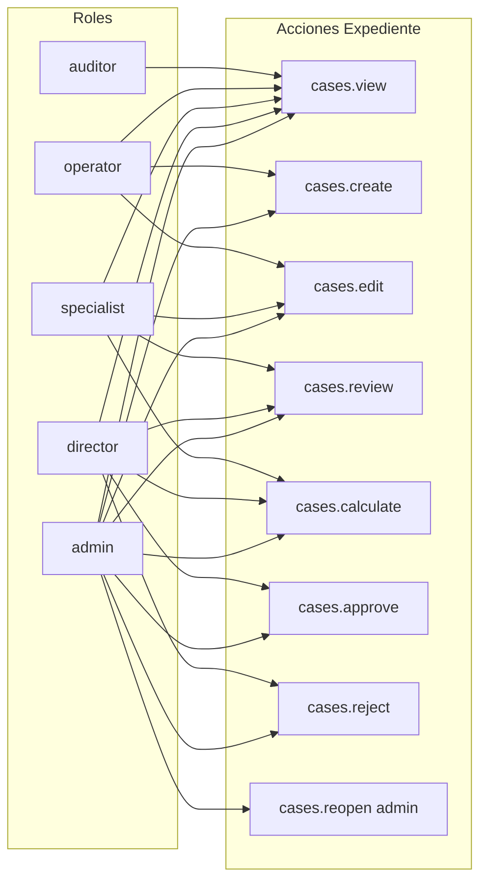
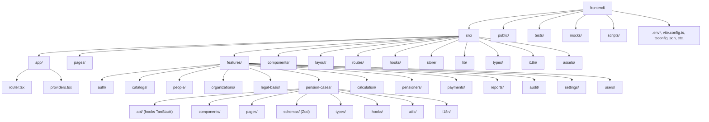
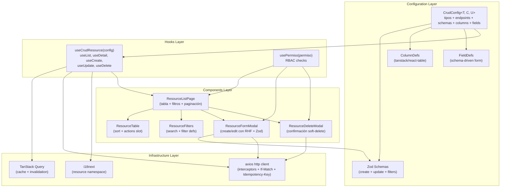
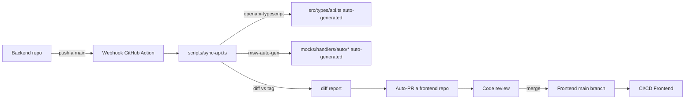
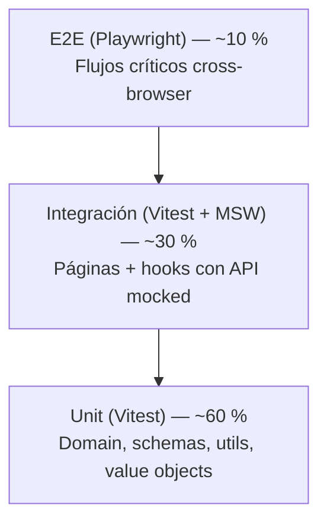

# Diseño de Arquitectura — Frontend del Sistema de Gestión de Pensionados (SGP)

| Campo | Valor |
|---|---|
| Proyecto | Sistema de Gestión de Pensionados (SGP) — Frontend |
| Cliente | Ministerio de Trabajo de la República de Cuba (INASS / SSIP) |
| Documento | Diseño de Arquitectura Frontend |
| Versión | 1.0 |
| Fecha | 2026-09-27 |
| Estado | Borrador para revisión del equipo de desarrollo |
| Documentos relacionados | `01_Requisitos_Funcionales_Frontend.md`, `03_Plan_De_Desarrollo_Frontend.md` |
| Documentos de origen | `02_Diseno_de_arquitectura.md` (backend v1.7 con 17 ADRs), `docs.json` (OpenAPI 3.0.0) |

---

## 1. Introducción

### 1.1 Propósito y alcance

Este documento define la arquitectura del **frontend React** del Sistema de Gestión de Pensionados (SGP): la visión del sistema, el stack tecnológico, la estructura modular, los patrones de diseño y su correspondencia con los principios SOLID, la estrategia de pruebas, la seguridad, la sincronización con el contrato OpenAPI cambiante del backend, la internacionalización y la integración con la pipeline de CI/CD. Es la guía vinculante para el equipo frontend: cualquier decisión de implementación que contravenga este documento debe pasar por una revisión arquitectónica y quedar registrada como ADR (sección 10).

El alcance arquitectónico cubre el **cliente web SPA** que consume la API REST del backend Laravel. No cubre el backend (que tiene su propio documento de arquitectura), ni el portal ciudadano de autogestión (si se decide construir, será un proyecto aparte), ni la migración de datos legados.

### 1.2 Principios rectores

1. **Contrato primero (Contract-First)**: el `docs.json` (OpenAPI 3) es la fuente de verdad del cliente HTTP. Los tipos TypeScript se generan automáticamente desde el spec con `openapi-typescript`. Los hooks de TanStack Query se tipan con los schemas del spec. Cualquier divergencia entre el spec y el código frontend se detecta en CI.

2. **Tolerancia al contrato cambiante**: el backend está en construcción y `docs.json` cambia sprint a sprint. La arquitectura debe absorber estos cambios sin reescrituras: regeneración automática de tipos en CI, handlers MSW versionados por tag de fase, feature branches para probar nuevas versiones antes de merge.

3. **Separación de capas (hexagonal pragmática)**: igual que el backend, el frontend separa Presentation, Application, Domain e Infrastructure. La capa de dominio (validaciones Zod, máquinas de estado, value objects) es framework-agnóstica y testeable en aislamiento.

4. **Estado mínimo, cache máximo**: TanStack Query como capa de cache server-state (datos del backend), Zustand como estado de cliente mínimo (sesión, UI toggles, filtros no URL). Sin reflejar datos del backend en Zustand (anti-patrón).

5. **Accesibilidad por diseño (a11y first)**: WCAG 2.1 AA desde el primer componente. ARIA, navegación por teclado, contraste, soporte de lectores de pantalla. No se añade a posteriori.

6. **Internacionalización por diseño (i18n first)**: 100 % de strings en archivos de traducción desde el primer commit. Sin literales en componentes.

7. **TypeScript estricto**: `strict: true`, sin `any` no justificado, tipos generados desde OpenAPI. La seguridad de tipos es la primera línea de defensa contra bugs.

8. **Mocking como herramienta de desarrollo, no de producción**: MSW intercepta requests en desarrollo y en tests. En producción, MSW se desactiva (el tráfico va al backend real). Esto permite desarrollo paralelo al backend sin esperas.

9. **Performance budget explícito**: budget de bundle definido (≤ 250 KB gzip inicial). Cada PR se mide contra el budget. Code-splitting por ruta y por rol. Lighthouse en CI.

10. **Trazabilidad de decisiones**: cada decisión arquitectónica se registra como ADR numerado, alineado con los 17 ADRs del backend.

### 1.3 Alineación con la arquitectura backend

El backend (Laravel monolito modular, 12 módulos bounded contexts) define los siguientes contratos que el frontend debe respetar:

- **API REST versionada** bajo `/api/v1` (path-based, ADR backend-13).
- **Auth Sanctum bearer** sin refresh tokens ni MFA documentados (decisión del cliente "Bearer simple").
- **Envelope de respuesta** `{data}` / `{data: [], meta: {current_page, per_page, total, last_page}}` / `{message}` / `{message, errors}` (RF-API-002).
- **Máquina de estados del expediente** con 4 estados (`submitted`, `under_review`, `approved`, `rejected`) y transiciones centralizadas (RF-EXP-005, ADR backend-07).
- **Transiciones como subrecurso** `POST /pension-cases/{id}/transitions` (ADR backend-07).
- **Soft delete** (no borrado físico): todas las operaciones `DELETE` son desactivaciones lógicas (RF-AUD-004).
- **RBAC con 5 roles** (admin, director, specialist, operator, auditor) y permisos granulares `módulo.acción` (RF-SEG-002).
- **Optimistic locking** vía `If-Match`/ETag (RF-API-003).
- **Idempotencia** opcional con header `Idempotency-Key` (RF-API-003).
- **Rate limiting** global 60 req/min por token (RNF-004).
- **Configuración general versionada** e inmutable (RF-CAT-005, ADR backend-16).
- **Secuencias centralizadas** para números de expediente y control bancario (ADR backend-17).
- **Sin WebSocket, sin SSE**: el frontend opera con polling para tareas asíncronas (exportaciones, nómina).

---

## 2. Visión arquitectónica

### 2.1 Diagrama de componentes



### 2.2 Diagrama de flujo de autenticación



### 2.3 Máquina de estados del expediente (client-side mirror)

El frontend refleja la máquina de estados del backend para mostrar visualmente las transiciones permitidas y deshabilitar las no permitidas. La fuente de verdad sigue siendo el backend.



### 2.4 Matriz de permisos (resumen visual)



---

## 3. Stack tecnológico

### 3.1 Stack completo justificado

| Componente | Versión | Justificación |
|---|---|---|
| **Vite** | 5.x | Build tool moderno, HMR instantáneo, plugin ecosystem maduro, sin config compleja. Alternativas (Webpack, Parcel, Rspack) rechazadas: Webpack lento, Parcel menos ecosystem, Rspack aún joven. |
| **React** | 18.x | Estándar de facto. Suspense, concurrent rendering, Server Components preparados para el futuro. React 19 aún no tiene soporte estable en todas las libs del stack. |
| **TypeScript** | 5.x con `strict: true` | Seguridad de tipos, autocompletado, refactor sin miedo. Generación de tipos desde OpenAPI. |
| **React Router** | v6 (data router) | Router estándar, loaders/actions, nested routes, lazy load por ruta. Alternativa TanStack Router evaluada pero rechazada por ecosistema aún joven. |
| **TanStack Query** | v5 | Cache server-state, invalidation automática, optimistic updates, retry, cancelación. Estándar de facto para datos server. |
| **Zustand** | 4.x | Estado de cliente mínimo, sin boilerplate, sin re-renders innecesarios. Alternativa Redux Toolkit rechazada: demasiado verboso para este scope. Alternativa Jotai evaluada:preferimos modelo store único de Zustand. |
| **TailwindCSS** | 3.4 | Utility-first, design system consistente, sin CSS muerto, dark mode trivial. Compatible con shadcn/ui y Headless UI. |
| **Headless UI** | 2.x | Componentes accesibles sin estilos opinados (Modal, Dropdown, Combobox, Tabs, Accordion). Complementa a Tailwind sin imponer design. Alternativa Radix UI también válida. |
| **shadcn/ui** | latest | Componentes copiados al repo (no npm), totalmente customizables, basados en Radix. Acelera la creación de design system sin vendor lock-in. |
| **React Hook Form** | 7.x | Performance (no re-render por cada keystroke), validación declarativa, integración con Zod vía `@hookform/resolvers`. Alternativa Formik rechazada: peor performance, más verbosa. |
| **Zod** | 3.x | Schemas tipados, inferencia TypeScript, validación runtime. Único source of truth para validación de formularios y parsing de respuestas API. |
| **i18next + react-i18next** | 23.x / 13.x | Estándar de facto, namespaces, lazy loading de traducciones, pluralización ICU, interpolación. |
| **openapi-typescript** | 6.x | Generación de tipos TypeScript desde `docs.json`. Sin dependencia runtime (solo dev). |
| **MSW (Mock Service Worker)** | 2.x | Mocking HTTP en dev y tests. Intercepta a nivel de Service Worker, no requiere cambios en código. Auto-generación de handlers desde OpenAPI parcial. |
| **Axios** | 1.x | Cliente HTTP con interceptors, timeout, cancelación. Alternativa `fetch` nativa evaluada: rechazada por falta de interceptors nativos y necesidad de re-implementar. |
| **Lucide React** | latest | Iconos SVG tree-shakeable. Alternativa Heroicons también válida. |
| **Vitest** | 1.x | Runner de tests compatible con Vite, snapshots, coverage. Alternativa Jest rechazada: configuración dual con Vite. |
| **Testing Library** | 14.x | Testing de componentes accesible (queries por rol, label, texto). Estándar de facto. |
| **Playwright** | 1.x | E2E cross-browser, paralelización, recording. Alternativa Cypress rechazada por performance y soporte cross-browser. |
| **ESLint** | 8.x + plugins | `eslint-plugin-react`, `@typescript-eslint`, `eslint-plugin-react-hooks`, `eslint-plugin-jsx-a11y`, `eslint-plugin-import`. |
| **Prettier** | 3.x + plugin-tailwindcss | Formato automático, orden de clases Tailwind. |
| **Lighthouse CI** | latest | Performance, accesibilidad, SEO, best practices en CI. |
| **GitHub Actions** | — | CI/CD integrado con el repo. Alternativa GitLab CI viable si el cliente lo prefiere. |

### 3.2 Stack rechazado y por qué

| Componente | Razón de rechazo |
|---|---|
| Next.js | Requerimiento explícito del cliente: "no usar nextjs". Razón plausible: despliegue on-premise Nginx con assets estáticos, sin Node runtime. |
| Redux Toolkit + RTK Query | Verbosidad innecesaria para el scope. RTK Query equivalente a TanStack Query pero más acoplado al ecosistema Redux. |
| Material UI (MUI) | Design system muy opinado, difícil de personalizar a la identidad INASS, bundle pesado. |
| Formik | Performance inferior a React Hook Form en formularios grandes (expediente tiene muchos campos). |
| Jest | Configuración dual con Vite añade complejidad innecesaria. Vitest es drop-in compatible. |
| Cypress | Performance y soporte cross-browser limitado vs Playwright. |
| React Hook Form + Yup | Preferimos Zod por inferencia TypeScript superior y ecosystem unificado (validación API + formularios). |

---

## 4. Estructura de carpetas

### 4.1 Árbol completo



### 4.2 Estructura interna de un feature (ejemplo: pension-cases)

```
src/features/pension-cases/
├── api/
│   ├── queries.ts          # usePensionCases, usePensionCase, useCaseTransitions
│   ├── mutations.ts        # useCreateCase, useTransitionCase, usePreviewCalculation
│   └── keys.ts             # queryKey factory: caseKeys.list(filters), caseKeys.detail(id)
├── components/
│   ├── CaseStatusFlow.tsx  # Visualización máquina de estados
│   ├── TransitionModal.tsx # Modal para acciones de transición
│   ├── SalaryRecordsTable.tsx
│   ├── ServiceRecordsTable.tsx
│   ├── WorkCyclesTable.tsx
│   ├── CaseHistoryTable.tsx
│   └── CaseFilters.tsx     # Filtros del listado
├── pages/
│   ├── CaseListPage.tsx
│   ├── CaseDetailPage.tsx
│   └── CaseCreatePage.tsx
├── schemas/
│   ├── case.schema.ts      # Zod schema para crear/editar expediente
│   ├── transition.schema.ts # Zod schema para acciones de transición
│   └── index.ts
├── types/
│   └── case.types.ts       # Tipos adicionales no inferidos de OpenAPI
├── hooks/
│   ├── useCasePermissions.ts # Hook de permisos específicos del módulo
│   └── useCaseActions.ts     # Hook con acciones disponibles según estado
├── utils/
│   ├── case-status.ts      # Helpers de estado (labels, colors, transitions)
│   └── case-export.ts      # Helpers de exportación CSV
└── i18n/
    ├── es-CU.json
    ├── es-ES.json
    └── en-US.json
```

### 4.3 Layout base

```
src/layout/
├── AppLayout.tsx           # Layout autenticado: header + sidebar + main + footer
├── PublicLayout.tsx        # Layout para login/recuperar/404 público
├── components/
│   ├── Sidebar.tsx         # Navegación lateral filtrada por rol
│   ├── TopBar.tsx          # Header con user, logout, idioma
│   ├── Breadcrumb.tsx
│   ├── PageContainer.tsx   # Wrapper de página con título + acciones
│   ├── EmptyState.tsx
│   ├── ErrorState.tsx
│   ├── LoadingState.tsx    # Skeletons y spinners
│   ├── Forbidden.tsx       # 403
│   ├── NotFound.tsx       # 404
│   └── OfflineBanner.tsx
└── sidebar-config.tsx      # Definición de entradas del sidebar por permiso
```

### 4.4 Capas transversales

```
src/
├── lib/
│   ├── http.ts             # Cliente Axios con interceptors
│   ├── query-client.ts     # Configuración TanStack Query
│   ├── msw.ts              # Setup MSW en dev/test
│   ├── i18n.ts             # Setup i18next
│   ├── zod-utils.ts        # Helpers Zod reutilizables
│   └── money.ts            # Value object Money (formato CUP)
├── store/
│   ├── auth-store.ts       # Estado de sesión (token, user, roles, permissions)
│   ├── ui-store.ts         # Estado de UI (sidebar colapsado, theme)
│   └── index.ts            # Compose stores
├── hooks/
│   ├── use-permiso.ts      # Hook de verificación de permiso
│   ├── use-debounce.ts     # Hook de debounce para inputs de búsqueda
│   ├── use-pagination.ts   # Hook de paginación con URL state
│   └── use-offline.ts      # Hook de detección de offline
├── types/
│   ├── api.ts              # Tipos generados desde OpenAPI (auto)
│   ├── domain.ts           # Tipos de dominio (CaseStatus, PensionerStatus)
│   └── common.ts           # Pagination, ErrorResponse, etc.
└── routes/
    ├── index.tsx           # Definición de rutas con guards
    ├── ProtectedRoute.tsx  # Guard de permisos
    └── loaders.ts          # Loaders de React Router para prefetch
```

---

## 5. Capas frontend

### 5.1 Presentation Layer

**Responsabilidad**: renderizar UI, capturar input del usuario, delegar lógica a capas inferiores. Sin lógica de negocio, sin acceso directo a API.

**Componentes**:
- **Pages**: componentes de nivel ruta (`CaseListPage`, `CaseDetailPage`).
- **Feature components**: componentes específicos de un módulo (`CaseStatusFlow`, `TransitionModal`).
- **Shared components**: componentes reutilizables cross-module (`Pagination`, `EmptyState`, `MoneyDisplay`).
- **Layout components**: estructura visual (`AppLayout`, `Sidebar`, `TopBar`).

**Reglas**:
- Páginas y feature components pueden usar hooks de TanStack Query y Zustand.
- Componentes shared deben ser **presentational** (reciben props, sin lógica de servidor).
- Sin imports de lib/http.ts directamente desde componentes shared.

### 5.2 Application Layer

**Responsabilidad**: orquestar casos de uso del frontend. Punto de contacto entre Presentation y Domain/Infrastructure.

**Componentes**:
- **TanStack Query hooks** (`usePensionCases`, `useCreateCase`): queries y mutations cacheadas.
- **Custom hooks** (`useCaseActions`, `useCasePermissions`): lógica derivada (qué acciones mostrar según estado y permiso).
- **Zustand stores**: estado de sesión, UI.

**Reglas**:
- Los hooks de TanStack Query son la **única** vía de acceso a datos del backend desde Presentation.
- Mutations devuelven el mutation result; el componente decide qué hacer (toast, navigate, refetch).
- Sin llamadas directas a `http.ts` desde Presentation.

### 5.3 Domain Layer

**Responsabilidad**: tipos y reglas de dominio, framework-agnósticas. Testeable sin React, sin red.

**Componentes**:
- **Zod schemas**: validación de formularios y parsing de respuestas API.
- **Máquinas de estado client-side mirror**: `CaseStateMachine` (mirror del backend `CaseStatus`), `PensionerStateMachine`.
- **Value objects**: `Money`, `CubanIdentityNumber`, `Period`.
- **Constants**: enums de dominio, tablas de transiciones, labels por estado.

**Reglas**:
- Sin imports de React, axios, TanStack Query.
- Sin acceso a red ni a storage.
- Testeable con Vitest puro.

### 5.4 Infrastructure Layer

**Responsabilidad**: integración con servicios externos (backend HTTP, storage del navegador, MSW).

**Componentes**:
- **HTTP client** (`lib/http.ts`): instancia Axios con interceptors (auth, errores 401, retries, idempotency).
- **MSW setup** (`lib/msw.ts`): handlers MSW generados desde OpenAPI + fixtures manuales.
- **Storage** (`lib/storage.ts`): wrappers sobre `sessionStorage` y `localStorage` con tipado.
- **OpenAPI sync scripts** (`scripts/sync-api.ts`): regeneración de tipos y handlers MSW.

**Reglas**:
- Es la única capa que puede importar Axios.
- Es la única capa que accede a `sessionStorage`/`localStorage`.
- MSW se activa solo en dev y tests.

---

## 6. Patrones de diseño frontend

### 6.1 Container/Presentational (pragmático)

No usamos la distinción estricta clásica (que ha caído en desuso con hooks), pero sí la convención:

- **Page components**: orquestan queries/mutations, manejan routing post-action.
- **Feature components**: reciben props (datos + callbacks), sin acceso a queries/mutations.
- **Shared components**: presentational puro, sin lógica de servidor.

Esto facilita testing: los feature/shared se testean con Vitest + Testing Library sin setup de mocks; las pages se testean con MSW.

### 6.2 Custom hooks por caso de uso

Cada caso de uso del backend (`ApproveCaseAction`, `PreviewCalculationAction`) tiene un mirror en el frontend como hook custom (`useApproveCase`, `usePreviewCalculation`). Esto:
- Centraliza la lógica de mutation + invalidation de cache.
- Reutiliza el hook en múltiples componentes.
- Tipa fuerte la llamada.

Ejemplo conceptual:

```typescript
// features/pension-cases/api/mutations.ts
export function useApproveCase() {
  const queryClient = useQueryClient();
  const t = useTranslation('expedientes');

  return useMutation({
    mutationFn: (vars: { caseId: number; note: string; legalBasisId: number }) =>
      http.post(`/api/v1/pension-cases/${vars.caseId}/transitions`, {
        action: 'approve',
        note: vars.note,
        legal_basis_id: vars.legalBasisId,
      }, {
        headers: { 'Idempotency-Key': crypto.randomUUID() }
      }),
    onSuccess: (_, vars) => {
      queryClient.invalidateQueries({ queryKey: caseKeys.detail(vars.caseId) });
      queryClient.invalidateQueries({ queryKey: caseKeys.lists() });
      toast.success(t('approve.success'));
    },
    onError: (error) => {
      if (error.response?.status === 422) {
        toast.error(t('approve.invalid_transition'));
      }
    },
  });
}
```

### 6.3 TanStack Query como cache layer

- **Queries**: `useQuery(['pension-cases', 'list', filters], fetcher)`. Cache automática, refetch en foco (configurable), deduplicación.
- **Mutations**: `useMutation(...)`. Invalidation selectiva (no global).
- **Optimistic updates**: en acciones no críticas (toggle de sidebar), no en acciones financieras.
- **Paginación**: `useQuery` con `placeholderData: keepPreviousData` para evitar flash al paginar.
- **Prefetch**: en hover sobre botón de detalle, prefetch del recurso.

### 6.4 Zustand para estado UI

Zustand almacena **solo** lo que no es cache server ni URL state:

- **Auth store**: `{ token, user, roles, permissions, login(), logout(), setSession() }`.
- **UI store**: `{ sidebarCollapsed, toggleSidebar(), locale, setLocale() }`.

No almacenar datos de listas, formularios, ni detalle de recursos. Eso vive en TanStack Query o en React Hook Form.

### 6.5 Zod como contrato runtime

Zod es el único source of truth para:

1. **Validación de formularios**: `useForm({ resolver: zodResolver(schema) })`.
2. **Parsing de respuestas API**: `schema.parse(response.data)` para respuestas críticas (login, auth/me).
3. **Tipos inferidos**: `type CreateCaseInput = z.infer<typeof createCaseSchema>`.

Sin validación manual duplicada. Si el spec OpenAPI cambia, el tipo generado cambia y Zod schema debe actualizarse en paralelo (con test de compatibilidad).

### 6.6 RBAC con route guards

```typescript
// src/routes/ProtectedRoute.tsx
export function ProtectedRoute({ permiso, children }: { permiso: string; children: ReactNode }) {
  const tienePermiso = usePermiso(permiso);
  if (!tienePermiso) return <Forbidden />;
  return <>{children}</>;
}

// src/routes/index.tsx
<Route path="/expedientes/:id" element={
  <ProtectedRoute permiso="cases.view">
    <CaseDetailPage />
  </ProtectedRoute>
} />
```

### 6.7 Feature-based organization

La estructura es **feature-first** (no layer-first): cada feature es autónoma con sus componentes, hooks, schemas, types, i18n. Las capas transversales (`lib/`, `hooks/`, `store/`, `types/`) viven en `src/` raíz.

Esto permite:
- Borrar un feature completo sin afectar a otros.
- Mover un feature a un paquete npm separado si crece mucho.
- Boundaries claras entre equipos (un desarrollador puede "poseer" un feature).

### 6.8 Lazy loading por ruta

```typescript
const CaseDetailPage = lazy(() => import('./pages/CaseDetailPage'));
```

Cada página se code-splitta. El bundle inicial solo incluye `AppLayout`, `Sidebar`, `TopBar`, página de login y página de error. El resto se carga on-demand.

### 6.9 Patrón CRUD genérico (Generic CRUD Pattern)

#### 6.9.1 Motivación

El SGP tiene **al menos 18 recursos CRUD** que comparten la misma forma funcional: los 16 catálogos uniformes (provincias, tipos de agencia, organismos, etc.), más municipios, agencias, personas, entidades, oficinas, firmas autorizadas, tipos y bases legales, usuarios, controles bancarios. Cada uno sigue el mismo ciclo: listado paginado con búsqueda y filtros, modal/Drawer de creación, modal/Drawer de edición con campos inmutables, acción de desactivación lógica con confirmación, manejo de errores 422 con mapeo a campos, optimistic locking opcional, idempotencia opcional, toast de éxito, invalidación de cache TanStack Query.

Implementar cada recurso de forma independiente produce (estimación conservadora para 18 recursos × ~600 LOC por CRUD completo) **~10.800 LOC duplicados**, con la consecuente carga de mantenimiento: un cambio en el manejo de 409 (conflicto de soft delete) o en la invalidación selectiva de cache debe replicarse 18 veces. Este patrón reduce ese código a **~2.000 LOC totales** (configuraciones + componentes base), con cada recurso nuevo añadiendo **~80 LOC de configuración** en vez de 600 LOC de implementación.

El patrón es **opt-in**: los recursos con lógica de negocio no estándar (expedientes con máquina de estados, pensionados con alta automática desde aprobación, cálculo con simulación, pagos con polling de exportaciones, reportes read-only con export en cola) **no usan este patrón** y se implementan con hooks y componentes específicos. La distinción se documenta por feature en `features/<mod>/README.md`.

#### 6.9.2 Arquitectura del patrón



#### 6.9.3 Tipos base

El patrón se ancla en un tipo `CrudConfig<TResource, TCreateInput, TUpdateInput>` genérico que captura toda la variabilidad de un recurso en un solo objeto inmutable. Los tipos `TResource`, `TCreateInput` y `TUpdateInput` se infieren de los schemas Zod + de los tipos generados desde OpenAPI, garantizando type-safety end-to-end.

```typescript
// src/types/crud.ts
import type { z } from 'zod';
import type { ColumnDef } from '@tanstack/react-table';
import type { FieldDef } from '@/components/crud/FieldRenderer';

export interface CrudConfig<
  TResource,
  TCreateInput,
  TUpdateInput
> {
  /** Identificación */
  resource: string;                  // 'catalogs' | 'people' | 'entities' | ...
  resourceKey: string;               // i18n namespace, e.g. 'catalogs'
  permisoPrefix: string;             // 'catalogs' | 'people' | ...

  /** Endpoints (path-based bajo /api/v1). Aceptan placeholders tipo :type */
  endpoints: {
    list: string;                    // '/api/v1/catalogs/:type'
    create: string;
    detail: (id: number | string) => string;
    update: (id: number | string) => string;
    delete: (id: number | string) => string;
  };

  /** Contexto dinámico (reemplaza placeholders en endpoints) */
  context?: Record<string, string | number>;  // { ':type': 'provinces' }

  /** Schemas Zod: único source of truth para validación + form */
  schemas: {
    create: z.ZodSchema<TCreateInput>;
    update: z.ZodSchema<TUpdateInput>;
    filters?: z.ZodSchema<unknown>;
  };

  /** Columnas de la tabla (tanstack/react-table) */
  columns: ColumnDef<TResource>[];

  /** Campos del formulario (schema-driven) */
  fields: FieldDef<TResource>[];

  /** Filtros del listado */
  filters?: FilterDef[];

  /** Búsqueda */
  search?: {
    fields: (keyof TResource)[];
    debounce: number;                // default 300ms
    placeholder?: string;
  };

  /** Permisos RBAC */
  permisos: {
    view: string;                    // 'catalogs.view'
    create: string;                  // 'catalogs.manage'
    edit: string;                    // 'catalogs.manage'
    delete: string;                  // 'catalogs.manage'
  };

  /** Campos inmutables tras creación (se deshabilitan en edición) */
  inmutableFields?: (keyof TResource)[];

  /** Etiqueta de acción delete (i18n) */
  deleteLabel?: 'deactivate' | 'remove';

  /** Optimistic locking vía If-Match/ETag */
  optimisticLocking?: boolean;

  /** Idempotency-Key en POST create */
  idempotencyKey?: boolean;

  /** Hooks de ciclo de vida para extensiones puntuales */
  hooks?: {
    beforeCreate?: (input: TCreateInput) => TCreateInput | Promise<TCreateInput>;
    afterCreate?: (resource: TResource) => void;
    beforeUpdate?: (input: TUpdateInput, current: TResource) => TUpdateInput | Promise<TUpdateInput>;
    afterUpdate?: (resource: TResource) => void;
    beforeDelete?: (resource: TResource) => boolean | Promise<boolean>;
    afterDelete?: (id: number | string) => void;
    /** Transforma la respuesta antes de devolverla (ej. normalizar campos) */
    transformResponse?: (resource: TResource) => TResource;
  };

  /** Invalidation selectiva tras mutación (override del default que invalida 'list') */
  invalidateOn?: {
    create?: (queryClient, resource) => void;
    update?: (queryClient, resource, id) => void;
    delete?: (queryClient, id) => void;
  };

  /** Configuración de exportación (opcional) */
  export?: {
    enabled: boolean;
    formats: ('csv' | 'excel')[];
    permiso: string;                  // 'reports.export'
    /** Endpoint de exportación (cola) */
    endpoint: string;
  };
}

export type AnyCrudConfig = CrudConfig<unknown, unknown, unknown>;
```

#### 6.9.4 Hook `useCrudResource`

El hook encapsula TanStack Query (queries y mutations), invalidación de cache, manejo de errores HTTP estándar (401, 403, 409, 422, 429), toasts i18n, hooks de ciclo de vida y cabeceras especiales (`If-Match`, `Idempotency-Key`). Recibe la `CrudConfig` y devuelve hooks individuales para que el consumidor los use de forma granular.

```typescript
// src/hooks/crud/useCrudResource.ts
import { useQuery, useMutation, useQueryClient, keepPreviousData } from '@tanstack/react-query';
import { useTranslation } from 'react-i18next';
import { http } from '@/lib/http';
import { useToast } from '@/components/ui/Toast';
import { usePermiso } from '@/hooks/use-permiso';
import type { CrudConfig } from '@/types/crud';

export function useCrudResource<T, C, U>(config: CrudConfig<T, C, U>) {
  const queryClient = useQueryClient();
  const t = useTranslation(config.resourceKey).t;
  const { success, error: errorToast } = useToast();
  const can = usePermiso();

  /** Resuelve un endpoint reemplazando placeholders del context */
  const resolveEndpoint = (path: string) => {
    let resolved = path;
    for (const [k, v] of Object.entries(config.context ?? {})) {
      resolved = resolved.replace(k, String(v));
    }
    return resolved;
  };

  /** Hook de listado con paginación, búsqueda y filtros */
  const useList = (params: {
    page?: number;
    per_page?: number;
    search?: string;
    sort?: string;
    order?: 'asc' | 'desc';
    [filter: string]: unknown;
  }) =>
    useQuery({
      queryKey: [config.resource, 'list', params, config.context],
      queryFn: async () => {
        const { data } = await http.get(resolveEndpoint(config.endpoints.list), { params });
        const envelope = data as { data: T[]; meta: PaginationMeta };
        if (config.hooks?.transformResponse) {
          envelope.data = envelope.data.map(config.hooks.transformResponse);
        }
        return envelope;
      },
      placeholderData: keepPreviousData,
      staleTime: 30_000,
      retry: (failureCount, error) => {
        // No reintentar 4xx (excepto 429)
        if (error.response?.status && error.response.status >= 400 && error.response.status < 500) {
          return error.response.status === 429 && failureCount < 3;
        }
        return failureCount < 3;
      },
    });

  /** Hook de detalle */
  const useDetail = (id?: number | string) =>
    useQuery({
      queryKey: [config.resource, 'detail', id, config.context],
      queryFn: async () => {
        const { data } = await http.get(resolveEndpoint(config.endpoints.detail(id!)));
        return data as T;
      },
      enabled: !!id,
    });

  /** Mutación de creación con Idempotency-Key opcional */
  const useCreate = () =>
    useMutation({
      mutationFn: async (input: C) => {
        const finalInput = config.hooks?.beforeCreate
          ? await config.hooks.beforeCreate(input)
          : input;
        const headers: Record<string, string> = {};
        if (config.idempotencyKey) {
          headers['Idempotency-Key'] = crypto.randomUUID();
        }
        const { data } = await http.post(resolveEndpoint(config.endpoints.create), finalInput, { headers });
        config.hooks?.afterCreate?.(data as T);
        return data as T;
      },
      onSuccess: (resource) => {
        if (config.invalidateOn?.create) {
          config.invalidateOn.create(queryClient, resource);
        } else {
          queryClient.invalidateQueries({ queryKey: [config.resource, 'list'] });
        }
        success(t('create.success'));
      },
      onError: (err: any) => {
        if (err.response?.status === 422) return; // handled by form
        if (err.response?.status === 429) {
          errorToast(t('errors.rate_limited'));
          return;
        }
        errorToast(t('create.error'));
      },
    });

  /** Mutación de actualización con optimistic locking opcional */
  const useUpdate = () =>
    useMutation({
      mutationFn: async ({ id, input }: { id: number | string; input: U }) => {
        const current = queryClient.getQueryData<T>([config.resource, 'detail', id, config.context]);
        const finalInput = config.hooks?.beforeUpdate && current
          ? await config.hooks.beforeUpdate(input, current)
          : input;
        const headers: Record<string, string> = {};
        if (config.optimisticLocking && current && 'updated_at' in current) {
          headers['If-Match'] = (current as any).updated_at as string;
        }
        const { data } = await http.patch(resolveEndpoint(config.endpoints.update(id)), finalInput, { headers });
        config.hooks?.afterUpdate?.(data as T);
        return data as T;
      },
      onSuccess: (resource, { id }) => {
        if (config.invalidateOn?.update) {
          config.invalidateOn.update(queryClient, resource, id);
        } else {
          queryClient.invalidateQueries({ queryKey: [config.resource, 'list'] });
          queryClient.setQueryData([config.resource, 'detail', id, config.context], resource);
        }
        success(t('update.success'));
      },
      onError: (err: any) => {
        if (err.response?.status === 422) return; // handled by form
        if (err.response?.status === 409) {
          errorToast(t('update.conflict'));
          return;
        }
        errorToast(t('update.error'));
      },
    });

  /** Mutación de desactivación lógica (soft delete) */
  const useDelete = () =>
    useMutation({
      mutationFn: async (resource: T) => {
        const id = (resource as any).id;
        const shouldProceed = config.hooks?.beforeDelete
          ? await config.hooks.beforeDelete(resource)
          : true;
        if (!shouldProceed) return;
        await http.delete(resolveEndpoint(config.endpoints.delete(id)));
        config.hooks?.afterDelete?.(id);
      },
      onSuccess: (_void, resource) => {
        const id = (resource as any).id;
        if (config.invalidateOn?.delete) {
          config.invalidateOn.delete(queryClient, id);
        } else {
          queryClient.invalidateQueries({ queryKey: [config.resource, 'list'] });
          queryClient.removeQueries({ queryKey: [config.resource, 'detail', id, config.context] });
        }
        success(t('delete.success'));
      },
      onError: (err: any) => {
        if (err.response?.status === 422) return;
        if (err.response?.status === 409) {
          errorToast(t('delete.has_references'));
          return;
        }
        errorToast(t('delete.error'));
      },
    });

  /** Helpers de permiso para el recurso */
  const canView = can(config.permisos.view);
  const canCreate = can(config.permisos.create);
  const canEdit = can(config.permisos.edit);
  const canDelete = can(config.permisos.delete);

  return { useList, useDetail, useCreate, useUpdate, useDelete, canView, canCreate, canEdit, canDelete };
}
```

#### 6.9.5 Componentes base

Los componentes `<ResourceListPage>`, `<ResourceFormModal>` y `<ResourceDeleteModal>` son **presentational puros** que reciben la `CrudConfig` + el estado de los hooks y renderizan de forma estándar. Están localizados en `src/components/crud/` y son compartidos por todos los recursos CRUD.

```typescript
// src/components/crud/ResourceListPage.tsx (esquema)
export function ResourceListPage<T, C, U>({ config }: { config: CrudConfig<T, C, U> }) {
  const [searchParams, setSearchParams] = useSearchParams();
  const { useList, useDelete, canCreate, canEdit, canDelete } = useCrudResource(config);
  const params = parseListParams(searchParams);
  const { data, isLoading } = useList(params);
  const deleteMutation = useDelete();
  const [formState, setFormState] = useState<{ open: boolean; resource?: T }>({ open: false });
  const [deleteState, setDeleteState] = useState<{ open: boolean; resource?: T }>({ open: false });

  const updateParams = (patch: Partial<typeof params>) =>
    setSearchParams(mergeParams(params, patch));

  return (
    <PageContainer
      title={t(`${config.resourceKey}:list.title`)}
      actions={canCreate ? (
        <Button onClick={() => setFormState({ open: true })}>
          <PlusIcon /> {t(`${config.resourceKey}:list.new`)}
        </Button>
      ) : null}
    >
      {config.search && <ResourceSearch config={config} value={params.search} onChange={...} />}
      {config.filters && <ResourceFilters config={config} values={params} onChange={updateParams} />}

      <ResourceTable
        columns={config.columns}
        data={data?.data ?? []}
        isLoading={isLoading}
        sort={params}
        onSortChange={updateParams}
        actions={(resource) => (
          <>
            {canEdit && <IconButton onClick={() => setFormState({ open: true, resource })}><EditIcon /></IconButton>}
            {canDelete && <IconButton onClick={() => setDeleteState({ open: true, resource })}><DeleteIcon /></IconButton>}
          </>
        )}
        emptyState={<EmptyState title={t(`${config.resourceKey}:list.empty`)} />}
      />

      <Pagination
        currentPage={data?.meta.current_page ?? 1}
        lastPage={data?.meta.last_page ?? 1}
        perPage={params.per_page}
        total={data?.meta.total ?? 0}
        onChange={(page, per_page) => updateParams({ page, per_page })}
      />

      {formState.open && (
        <ResourceFormModal
          config={config}
          resource={formState.resource}
          onClose={() => setFormState({ open: false })}
        />
      )}
      {deleteState.open && deleteState.resource && (
        <ResourceDeleteModal
          config={config}
          resource={deleteState.resource}
          onConfirm={async () => {
            await deleteMutation.mutateAsync(deleteState.resource!);
            setDeleteState({ open: false });
          }}
          isPending={deleteMutation.isPending}
          onClose={() => setDeleteState({ open: false })}
        />
      )}
    </PageContainer>
  );
}
```

```typescript
// src/components/crud/ResourceFormModal.tsx (esquema)
export function ResourceFormModal<T, C, U>({
  config, resource, onClose,
}: { config: CrudConfig<T, C, U>; resource?: T; onClose: () => void }) {
  const isEdit = !!resource;
  const { useCreate, useUpdate } = useCrudResource(config);
  const createMutation = useCreate();
  const updateMutation = useUpdate();
  const t = useTranslation(config.resourceKey).t;

  const form = useForm<C | U>({
    resolver: zodResolver(isEdit ? config.schemas.update : config.schemas.create),
    defaultValues: resource ?? {},
  });

  const onSubmit = form.handleSubmit(async (input) => {
    try {
      if (isEdit && resource) {
        await updateMutation.mutateAsync({ id: (resource as any).id, input: input as U });
      } else {
        await createMutation.mutateAsync(input as C);
      }
      onClose();
    } catch (err: any) {
      if (err.response?.status === 422) {
        const fieldErrors = err.response.data.errors as Record<string, string[]>;
        for (const [field, messages] of Object.entries(fieldErrors)) {
          form.setError(field as keyof (C | U), { message: messages[0] });
        }
      }
      // otros errores ya manejados por el hook con toast
    }
  });

  return (
    <Dialog open onOpenChange={onClose}>
      <DialogContent className="max-w-2xl">
        <DialogHeader>
          <DialogTitle>{t(isEdit ? 'edit.title' : 'create.title')}</DialogTitle>
        </DialogHeader>
        <form onSubmit={onSubmit} className="space-y-4">
          {config.fields.map((field) => (
            <FieldRenderer
              key={String(field.name)}
              field={field}
              form={form}
              disabled={isEdit && config.inmutableFields?.includes(field.name as keyof T)}
              context={config.context}
            />
          ))}
          <DialogFooter>
            <Button type="button" variant="ghost" onClick={onClose}>
              {t('common:cancel')}
            </Button>
            <Button type="submit" disabled={form.formState.isSubmitting}>
              {t('common:save')}
            </Button>
          </DialogFooter>
        </form>
      </DialogContent>
    </Dialog>
  );
}
```

#### 6.9.6 Ejemplo de uso: catálogos uniformes

La aplicación más clara del patrón es el feature `catalogs`, donde los 16 tipos comparten el mismo endpoint `/api/v1/catalogs/{type}` y solo varían en los campos condicionales del schema `CatalogItem`.

```typescript
// src/features/catalogs/config/catalog-config.ts
import { z } from 'zod';
import type { CrudConfig } from '@/types/crud';
import type { components } from '@/types/api';  // generado desde OpenAPI

type CatalogItem = components['schemas']['CatalogItem'];

// Schema base: campos comunes a todos los catálogos
const baseSchema = z.object({
  code: z.string().min(1).max(10),
  name: z.string().min(1).max(80),
  description: z.string().max(255).optional(),
});

// Schemas por tipo (campos condicionales)
const schemasByType: Record<string, z.ZodSchema> = {
  'pension-regimes': baseSchema.extend({
    months_per_year: z.number().int().positive(),
  }),
  'income-concepts': baseSchema.extend({
    applies_base_salary: z.boolean().default(false),
  }),
  // ... otros tipos solo heredan baseSchema
};

export function getCatalogConfig(type: string): CrudConfig<CatalogItem, any, any> {
  const schema = schemasByType[type] ?? baseSchema;
  return {
    resource: 'catalogs',
    resourceKey: 'catalogs',
    permisoPrefix: 'catalogs',
    endpoints: {
      list: '/api/v1/catalogs/:type',
      create: '/api/v1/catalogs/:type',
      detail: (id) => `/api/v1/catalogs/:type/${id}`,
      update: (id) => `/api/v1/catalogs/:type/${id}`,
      delete: (id) => `/api/v1/catalogs/:type/${id}`,
    },
    context: { ':type': type },
    schemas: { create: schema, update: schema },
    columns: [
      { id: 'code', header: 'catalogs:list.columns.code' },
      { id: 'name', header: 'catalogs:list.columns.name' },
      { id: 'description', header: 'catalogs:list.columns.description' },
      { id: 'actions', header: '', cell: ({ row }) => <ResourceRowActions row={row} /> },
    ],
    fields: [
      { name: 'code', type: 'text', label: 'catalogs:form.code', required: true },
      { name: 'name', type: 'text', label: 'catalogs:form.name', required: true },
      { name: 'description', type: 'textarea', label: 'catalogs:form.description' },
      {
        name: 'months_per_year',
        type: 'number',
        label: 'catalogs:form.months_per_year',
        required: true,
        condition: (ctx) => ctx?.[':type'] === 'pension-regimes',
      },
      {
        name: 'applies_base_salary',
        type: 'checkbox',
        label: 'catalogs:form.applies_base_salary',
        condition: (ctx) => ctx?.[':type'] === 'income-concepts',
      },
    ],
    inmutableFields: ['code'],
    permisos: {
      view: 'catalogs.view',
      create: 'catalogs.manage',
      edit: 'catalogs.manage',
      delete: 'catalogs.manage',
    },
    optimisticLocking: true,
    deleteLabel: 'deactivate',
  };
}
```

```typescript
// src/features/catalogs/pages/CatalogListPage.tsx
import { useParams, Navigate } from 'react-router-dom';
import { getCatalogConfig } from '../config/catalog-config';
import { ResourceListPage } from '@/components/crud/ResourceListPage';
import { VALID_CATALOG_TYPES } from '../config/catalog-types';

export function CatalogListPage() {
  const { type = '' } = useParams();
  if (!VALID_CATALOG_TYPES.includes(type)) {
    return <Navigate to="/catalogos" replace />;
  }
  const config = getCatalogConfig(type);
  return <ResourceListPage config={config} />;
}
```

Con **~120 LOC de configuración** se obtiene un CRUD completo de un catálogo: listado paginado con búsqueda, ordenamiento, filtros, modal de creación, modal de edición con `code` inmutable, acción de desactivación con confirmación, manejo de 422/409/429, optimistic locking, invalidación de cache, toasts i18n. Replicar esto manualmente costaría ~600 LOC por catálogo × 16 catálogos = **~9.600 LOC evitados**.

#### 6.9.7 Cuándo NO usar el patrón

El patrón genérico **no se aplica** a los siguientes recursos, que requieren implementación específica con hooks y componentes propios:

| Recurso | Razón de exclusión |
|---|---|
| `pension-cases` (expedientes) | Máquina de estados (4 estados + transiciones), subregistros anidados (salarios/servicios/ciclos), acción `calculation-preview`, historial append-only, reapertura admin exclusiva. Complejidad no abarcable por un CRUD genérico. |
| `pensioners` (pensionados) | Alta automática desde aprobación de expediente (no es creable directamente). Reclasificación como acción especial. Banner de fallecimiento. |
| `pension-cases/{id}/transitions` | Subrecurso de acción (no CRUD). Mutación con validación de máquina de estados server-side. |
| `pension-cases/{id}/calculation-preview` | Read-only con simulación no persistente. |
| `bank-controls` | Tiene subrecurso de exportación de nómina en cola con polling. |
| `reports` y `exports` | No son CRUD — son reportes parametrizables con exportación en cola. |
| `audit` | Read-only con visualización de diff JSON inline. |
| `auth/login`, `auth/logout`, `auth/me` | Acciones específicas de auth, no CRUD. |

La regla operativa: **un recurso es candidato al patrón CRUD genérico si y solo si sus endpoints siguen la forma RESTful estándar (`GET list`, `POST create`, `GET/{id} detail`, `PATCH/{id} update`, `DELETE/{id} deactivate`) sin acciones especiales ni subrecursos anidados con lógica propia**.

#### 6.9.8 Extensibilidad

El patrón es extensible sin modificar los componentes base mediante:

1. **Hooks de ciclo de vida** (`beforeCreate`, `afterCreate`, etc.): para transformaciones puntuales (ej. formatear `effective_from` antes de enviar, recalcular un campo derivado).
2. **`invalidateOn` override**: para invalidaciones de cache no estándar (ej. crear un `municipality` invalida también el listado de `agencies` por coherencia geográfica).
3. **`transformResponse`**: para normalizar respuestas que no siguen el envelope estándar.
4. **`FieldDef` con `condition`**: para mostrar/ocultar campos condicionalmente según el contexto (ej. `months_per_year` solo en `pension-regimes`).
5. **Slot `actions` en columnas**: para acciones adicionales por fila (ej. "Ver detalles", "Duplicar").

Cuando la extensión requiere lógica más profunda (múltiples mutaciones coordinadas, UI adicional como wizard, etc.), el recurso **deja de usar el patrón** y se implementa con hooks específicos — esto se documenta en `features/<mod>/README.md` con la justificación.

#### 6.9.9 Testing del patrón

- **Tests del hook `useCrudResource`**: suite de tests con Vitest + MSW que valida, para una `CrudConfig` de prueba, los flujos de list/create/update/delete, manejo de 401/403/409/422/429, invalidación de cache, hooks de ciclo de vida, optimistic locking. **Cobertura ≥ 95 %** — al ser el hook compartido por 18+ recursos, su cobertura es crítica.
- **Tests de componentes base**: `ResourceListPage`, `ResourceFormModal`, `ResourceDeleteModal` con Testing Library — validación de render, interacciones, a11y.
- **Tests de configuración**: por cada `CrudConfig` concreta (ej. `catalogConfig`), test que valida que el schema Zod matchea el tipo generado desde OpenAPI (contract test).
- **Tests E2E**: un flujo CRUD completo (crear, editar, desactivar) para un recurso representativo — los demás recursos asumen el mismo comportamiento por construcción.

#### 6.9.10 Métricas de reducción de duplicación

| Métrica | Sin patrón (estimación) | Con patrón |
|---|---|---|
| LOC por recurso CRUD | ~600 | ~120 (configuración) |
| Recursos CRUD totales | 18 | 18 |
| LOC totales CRUD | ~10.800 | ~2.160 + ~1.500 base = ~3.660 |
| Reducción de LOC | — | **~66 %** |
| Cambio transversal (ej. 409 handling) | 18 archivos | 1 archivo (`useCrudResource`) |
| Tests requeridos por recurso | ~30 | ~5 (configuración) + tests base compartidos |
| Tiempo de incorporación de nuevo CRUD | ~3 días | ~4 horas |

La decisión se registra formalmente como **ADR-FE-18** (ver sección 10).

---

## 7. Estrategia híbrida de sincronización con docs.json

### 7.1 Visión general

El `docs.json` del backend cambia sprint a sprint (actualmente solo cubre 3 tags: Auth, Catalogs, Settings). La estrategia híbrida combina:

1. **Auto-generación en CI/CD**: cada push al repo del backend (que actualiza `docs/backend/docs.json`) dispara un webhook que regenera tipos y handlers MSW en el repo frontend.
2. **Tags locked por fase**: el frontend se ata a una versión tagged de `docs.json` (ej. `v1.0.0-fase1`) por fase. Solo se actualiza tras gate de fase backend aprobado.
3. **Feature branches para probar nuevas versiones**: cuando el backend publica una nueva versión candidata, se crea branch `feature/sync-api-fase-N` para probar la regeneración antes de mergear a main.

### 7.2 Pipeline de sincronización



### 7.3 Comandos disponibles

```bash
# Regenerar tipos y handlers MSW desde el docs.json local (en repo backend)
npm run sync:api -- --backend=../backend-repo/docs/backend/docs.json

# Regenerar desde una URL firmada del backend staging
npm run sync:api -- --url=https://staging.sgp.cu/api/docs.json

# Regenerar desde un tag específico
npm run sync:api -- --tag=v1.0.0-fase1

# Validar que los tipos generados son compatibles con los schemas Zod
npm run validate:api

# Generar diff de cambios entre dos versiones
npm run diff:api -- --from=v1.0.0-fase1 --to=v1.1.0-fase2
```

### 7.4 Manejo de endpoints no publicados

Para los endpoints previstos en la arquitectura backend pero no publicados en `docs.json` (People, Organizations, LegalBasis, PensionCases, etc.), el frontend:

1. **Define schemas Zod manuales** en `src/features/<mod>/schemas/` basados en el modelo de datos del documento `03_Modelo_de_datos.md`.
2. **Crea handlers MSW manuales** en `mocks/handlers/manual/<mod>/` con fixtures JSON realistas.
3. **Desarrolla la UI** contra los handlers MSW.
4. **Cuando el backend publica el endpoint real**, se elimina el handler MSW manual y se valida que la respuesta real matchea el schema Zod (test de contrato).

### 7.5 Versiones tagged esperadas

| Tag backend | Fase | Endpoints cubiertos |
|---|---|---|
| `v1.0.0-fase0` | F0 | Auth (login, me, logout) |
| `v1.0.0-fase1` | F1 | + Catalogs (16 tipos + municipalities + agencies) + Settings (general-settings) + People + Users con roles/permissions |
| `v1.1.0-fase2` | F2 | + Organizations (entities + offices + signatures) + LegalBasis |
| `v1.2.0-fase3` | F3 | + PensionCases (CRUD + subregistros + transitions + history) |
| `v1.3.0-fase4` | F4 | + PensionCalculation (eligibility + cuantía + preview) |
| `v1.4.0-fase5` | F5 | + Pensioners + BankControls + nómina |
| `v1.5.0-fase6` | F6 | + Reports + Exports + Hardening (idempotencia, If-Match) |
| `v1.6.0-fase7` | F7 | Hardening final + performance |

---

## 8. Estrategia de internacionalización (i18n)

### 8.1 Configuración

- **Librería**: `i18next` + `react-i18next`.
- **Idiomas soportados**: `es-CU` (Cuba, prioritario), `es-ES` (español neutro), `en-US` (inglés americano, opcional).
- **Detección**: `navigator.language` con fallback a `es-CU`. Persistencia en `localStorage`.
- **Carga**: lazy-loading por namespace. Solo se cargan los namespaces de las rutas visitadas.

### 8.2 Namespaces

Cada feature tiene su propio namespace. Namespaces transversales:

| Namespace | Contenido |
|---|---|
| `common` | Botones (guardar, cancelar, eliminar), estados vacíos, errores HTTP comunes |
| `auth` | Login, logout, sesión expirada |
| `catalogs` | Catálogos + municipios + agencias + configuración general |
| `people` | Personas |
| `organizations` | Entidades + oficinas + firmas |
| `legal-basis` | Base legal |
| `pension-cases` | Expedientes + subregistros + transiciones |
| `calculation` | Cálculo + simulación |
| `pensioners` | Pensionados + reclasificación |
| `payments` | Control bancario + nómina |
| `reports` | Reportes + dashboard |
| `audit` | Bitácoras |
| `users` | Gestión de usuarios |
| `errors` | Mensajes de error detallados por código |

### 8.3 Convenciones de keys

```json
// features/pension-cases/i18n/es-CU.json
{
  "list": {
    "title": "Expedientes",
    "empty": "No hay expedientes para los filtros seleccionados",
    "columns": {
      "number": "Número",
      "applicant": "Proponente",
      "status": "Estado",
      "requested_at": "Fecha solicitud"
    }
  },
  "detail": {
    "tabs": {
      "summary": "Resumen",
      "subrecords": "Subregistros",
      "history": "Historial",
      "calculation": "Cálculo"
    }
  },
  "transitions": {
    "approve": {
      "title": "Aprobar expediente",
      "note_label": "Nota de aprobación",
      "note_required": "La nota es obligatoria",
      "legal_basis_label": "Base legal",
      "legal_basis_required": "La base legal es obligatoria para aprobar",
      "success": "Expediente aprobado correctamente",
      "invalid_transition": "No se puede aprobar desde el estado actual"
    }
  },
  "status": {
    "submitted": "Solicitud",
    "under_review": "Revisión",
    "approved": "Aprobado",
    "rejected": "Denegado"
  }
}
```

### 8.4 Formatos localizados

```typescript
// lib/i18n.ts
export const formatters = {
  'es-CU': {
    date: (d: Date) => format(d, 'dd/MM/yyyy', { locale: esCU }),
    money: (amount: number) => new Intl.NumberFormat('es-CU', {
      style: 'currency',
      currency: 'CUP',
      minimumFractionDigits: 2,
    }).format(amount),
    number: (n: number) => new Intl.NumberFormat('es-CU').format(n),
  },
  // ... es-ES, en-US
};
```

### 8.5 Validación

- Script CI `npm run validate:i18n` asegura que todos los namespaces tienen las mismas keys en los tres idiomas.
- Sin literales en componentes (regla ESLint customizada).

---

## 9. Estrategia de testing

### 9.1 Pirámide de tests



### 9.2 Cobertura por capa

| Capa | Tipo de test | Cobertura mínima |
|---|---|---|
| Domain (Zod schemas, state machines, value objects) | Unit | 95 % |
| Application (hooks TanStack Query) | Integración con MSW | 80 % |
| Presentation (componentes shared) | Unit + Testing Library | 80 % |
| Presentation (feature components) | Integración con MSW | 70 % |
| Pages | E2E (flujos críticos) | 5 flujos: login, crear expediente, aprobar, crear pensionado, generar reporte |
| Infrastructure (http client, MSW) | Integración | 70 % |

### 9.3 Tests de contrato

Cada endpoint publicado en `docs.json` tiene un test de contrato que:
1. Carga el handler MSW auto-generado.
2. Llama al hook TanStack Query correspondiente.
3. Verifica que el tipo de retorno matchea el tipo generado desde OpenAPI.
4. Verifica que el schema Zod acepta la respuesta.

Si el backend cambia el contrato, el test falla y bloquea el merge.

### 9.4 Tests E2E críticos

| Test | Descripción |
|---|---|
| `e2e/auth.spec.ts` | Login exitoso, logout, sesión expirada, bloqueo tras 5 intentos |
| `e2e/expediente-create-approve.spec.ts` | Flujo completo: operador crea → specialist revisa → director aprueba → pensionado creado |
| `e2e/expediente-reject.spec.ts` | Flujo de denegación con motivo obligatorio |
| `e2e/pensionado-reclacify.spec.ts` | Reclasificación de pensionado por director |
| `e2e/report-export.spec.ts` | Generación y descarga de reporte CSV en cola |

### 9.5 Tools

- **Vitest** para unit/integration.
- **Testing Library** para queries accesibles (`getByRole`, `getByLabelText`).
- **MSW** para mocking en tests de integración y E2E (modo "node" en E2E).
- **Playwright** para E2E cross-browser (Chromium, Firefox, WebKit).
- **axe-core** para tests de accesibilidad automatizados.
- **Lighthouse CI** para performance.

---

## 10. Architecture Decision Records (ADRs)

### ADR-FE-01: Vite como build tool

- **Decisión**: usar Vite 5.x como build tool y dev server.
- **Contexto**: necesidad de HMR rápido, configuración mínima, soporte TypeScript nativo, ecosystem maduro.
- **Alternativas**: Webpack 5 (lento, configuración compleja), Parcel (menos ecosystem), Rspack (aún joven).
- **Consecuencias**: 
  - (+) Dev experience superior, build < 5 s en proyecto medio.
  - (+) Plugins compatibles con Rollup ecosystem.
  - (-) Algunas libs legacy pueden tener problemas de compatibilidad con ESM.

### ADR-FE-02: React 18 con Suspense pero sin Server Components

- **Decisión**: React 18 con Suspense y concurrent rendering, sin Server Components.
- **Contexto**: el despliegue es on-premise con Nginx + assets estáticos (sin Node runtime). Server Components requieren servidor Node.
- **Alternativas**: React 19 (aún inestable en algunas libs), Remix (server-side, no compatible con static hosting).
- **Consecuencias**:
  - (+) Stack estable y maduro.
  - (-) Sin beneficios de RSC (cero JS inicial, streaming). Se mitiga con code-splitting agresivo y lazy loading.

### ADR-FE-03: Zustand + TanStack Query (no Redux Toolkit)

- **Decisión**: Zustand para client state + TanStack Query para server state.
- **Contexto**: el scope del sistema no justifica el boilerplate de Redux Toolkit + RTK Query.
- **Alternativas**: Redux Toolkit + RTK Query (verbosidad innecesaria), Jotai (modelo atómico menos familiar al equipo), Context API (performance en re-renders).
- **Consecuencias**:
  - (+) Menor código, menor curva, mejor DX.
  - (+) Separación clara client state vs server state.
  - (-) Sin DevTools unificado como Redux. Se mitiga con TanStack Query Devtools y Zustand middleware de logging.

### ADR-FE-04: TailwindCSS + shadcn/ui + Headless UI

- **Decisión**: TailwindCSS como base, shadcn/ui como design system copy-paste, Headless UI para componentes accesibles.
- **Contexto**: necesidad de design system consistente, accesible y fácilmente customizable a identidad INASS.
- **Alternativas**: MUI v5 (muy opinado, difícil de customizar), Chakra UI (bundle pesado), Ant Design (design no apropiado para gobierno).
- **Consecuencias**:
  - (+) Sin vendor lock-in (shadcn/ui es código propio).
  - (+) Tree-shaking perfecto (solo lo que se usa).
  - (-) Mayor trabajo upfront en design tokens. Se mitiga con shadcn/ui starter.

### ADR-FE-05: React Hook Form + Zod

- **Decisión**: React Hook Form para gestión de formularios + Zod para validación.
- **Contexto**: formularios grandes (expediente, persona) con validación estricta (CI cubano, DECIMAL money, fechas).
- **Alternativas**: Formik + Yup (peor performance, menos inferencia TS), TanStack Form (aún joven), React Final Form (ecosystem reducido).
- **Consecuencias**:
  - (+) Performance superior en forms grandes (no re-render por keystroke).
  - (+) Zod como único source of truth: formularios + parsing API + inferencia TS.
  - (-) Mayor curva para devs unfamiliarizados. Se mitiga con documentación interna.

### ADR-FE-06: Feature-first organization

- **Decisión**: organizar `src/` por features (auth, catalogs, people, etc.) en vez de por capas.
- **Contexto**: 10+ módulos del sistema con autonomía relativa.
- **Alternativas**: layer-first (components/, hooks/, services/ anidados), hybrid.
- **Consecuencias**:
  - (+) Borrado/movimiento de features sin afectar a otros.
  - (+) Boundaries claras entre equipos.
  - (-) Imports más largos. Se mitiga con path aliases `@/features/<mod>`.

### ADR-FE-07: MSW para mocking (no Axios Mock Adapter ni JSON Server)

- **Decisión**: MSW (Mock Service Worker) para mocking en dev y tests.
- **Contexto**: el backend está en construcción y el frontend debe desarrollarse paralelamente.
- **Alternativas**: Axios Mock Adapter (no prueba la capa red real), JSON Server (servidor separado, no comparte código con el real), Nock (Node only, no browser).
- **Consecuencias**:
  - (+) Misma stack en dev y tests (Service Worker intercepta de verdad).
  - (+) Auto-generación de handlers desde OpenAPI para endpoints publicados.
  - (-) Setup inicial más complejo. Se mitiga con helpers y documentación.

### ADR-FE-08: Token en sessionStorage (no localStorage ni cookie)

- **Decisión**: almacenar el token Sanctum en `sessionStorage` (no `localStorage`, no cookie).
- **Contexto**: hardening OWASP. `localStorage` persiste entre sesiones y es accesible a XSS. Cookies httpOnly no son viables con el esquema Sanctum bearer actual (sin backend support documentado).
- **Alternativas**: `localStorage` (persistente pero vulnerable a XSS), memory only (se pierde al refrescar), cookie httpOnly (requiere backend support).
- **Consecuencias**:
  - (+) Token sobrevive refresco de página pero se pierde al cerrar el navegador (mejor seguridad que `localStorage`).
  - (-) Tras cerrar navegador, usuario debe re-login. Aceptado por cliente (esquema "Bearer simple").
  - (-) Sigue siendo vulnerable a XSS. Se mitiga con CSP estricta y sanitización.

### ADR-FE-09: Path-based API versioning (`/api/v1`)

- **Decisión**: alinearse con el versionamiento path-based del backend.
- **Contexto**: el backend usa `/api/v1` fijo en el path (no header, no Accept).
- **Consecuencias**:
  - (+) URLs autodescriptivas, cacheable, simple.
  - (-) Breaking changes requieren bump de versión (path) → deploy conjunto.

### ADR-FE-10: i18n con namespaces por feature

- **Decisión**: cada feature tiene su propio namespace i18n.
- **Contexto**: evitar colisión de keys y facilitar carga diferida.
- **Consecuencias**:
  - (+) Solo se cargan traducciones de features en uso.
  - (+) Equipos pueden "poseer" sus traducciones.
  - (-) Keys duplicadas posibles (ej. "title" en cada namespace). Se mitiga con namespaces explícitos `t('pension-cases:list.title')`.

### ADR-FE-11: CI/CD con GitHub Actions

- **Decisión**: GitHub Actions para CI/CD.
- **Contexto**: repo en GitHub, equipo familiar con la herramienta.
- **Alternativas**: GitLab CI, Jenkins, CircleCI.
- **Consecuencias**:
  - (+) Integración nativa con GitHub, marketplace amplio.
  - (-) Vendor lock-in moderado.

### ADR-FE-12: Performance budget de 250 KB gzip inicial

- **Decisión**: budget hard de 250 KB gzip para bundle inicial (sin lazy-load).
- **Contexto**: sistema para uso en redes potencialmente lentas del Ministerio.
- **Consecuencias**:
  - (+) Performance garantizada.
  - (-) Requiere code-splitting agresivo y disciplina.

### ADR-FE-13: Code-splitting por ruta Y por rol

- **Decisión**: lazy-load de páginas + lazy-load condicional de features por rol (auditor no carga componentes de edición).
- **Contexto**: reducir bundle para roles con scope limitado.
- **Consecuencias**:
  - (+) Bundle inicial menor para auditor.
  - (-) Lógica condicional de import dinámico. Se mitiga con helpers.

### ADR-FE-14: No MFA ni refresh tokens (alineado con spec backend actual)

- **Decisión**: no implementar MFA ni refresh tokens en el frontend MVP.
- **Contexto**: el spec backend actual no documenta refresh ni MFA. Cliente eligió "Bearer simple".
- **Consecuencias**:
  - (+) Simplicidad, alineación con backend.
  - (-) UX: al expirar el token, redirección a login. Se mitiga con mensajes claros.
  - (-) Sin MFA para roles sensibles (director, admin). Recomendación futura: ADR backend para añadir MFA.

### ADR-FE-15: Webhook de sync API con auto-PR

- **Decisión**: cada push al backend que cambia `docs.json` dispara webhook que regenera tipos y handlers MSW y abre auto-PR al repo frontend.
- **Contexto**: el `docs.json` cambia sprint a sprint; sincronización manual es propensa a olvidos.
- **Consecuencias**:
  - (+) Tipos siempre alineados con spec.
  - (-) Posible ruido de PRs automáticos. Se mitiga con etiqueta `auto-sync-api` y consolidación semanal.

### ADR-FE-16: Testing con Vitest (no Jest)

- **Decisión**: Vitest como runner de tests unitarios y de integración.
- **Contexto**: compatibilidad nativa con Vite, sin config dual.
- **Consecuencias**:
  - (+) Setup unificado con build.
  - (+) API compatible con Jest (curva de migración trivial).
  - (-) Algunas libs auxiliares tienen mejor soporte Jest. Se mitiga con shims.

### ADR-FE-17: Playwright para E2E (no Cypress)

- **Decisión**: Playwright para E2E cross-browser.
- **Contexto**: necesidad de soporte Chromium + Firefox + WebKit, paralelización nativa.
- **Alternativas**: Cypress (mejor DX inicial pero peor cross-browser y performance), TestCafe (ecosystem reducido).
- **Consecuencias**:
  - (+) Cross-browser real, paralelización, recording.
  - (-) Curva de aprendizaje ligeramente mayor.

### ADR-FE-18: Patrón CRUD genérico (Generic CRUD Pattern)

- **Decisión**: implementar un patrón CRUD genérico configurable (`CrudConfig<T, C, U>` + hook `useCrudResource` + componentes `ResourceListPage`, `ResourceFormModal`, `ResourceDeleteModal`) para los 18+ recursos CRUD estándar del sistema (catálogos, personas, entidades, oficinas, firmas, base legal, usuarios, controles bancarios).
- **Contexto**: 18 recursos CRUD compartirían la misma forma funcional (list/create/edit/delete con paginación, búsqueda, filtros, soft delete, manejo de errores HTTP estándar). La implementación manual produciría ~10.800 LOC duplicados, con la carga de mantenimiento asociada (cualquier cambio transversal requeriría editar 18 archivos).
- **Alternativas**:
  - *(a) Code generation from OpenAPI* (ej. `openapi-generator` con plantillas custom React): rechazada porque las plantillas generadas son difíciles de customizar sin perder la regeneración, y porque el frontend ya tiene lógica no derivable del spec (filtros, schemas de formulario, inmutabilidad de campos).
  - *(b) Wrapper ligero sobre TanStack Query sin componentes base*: rechazada porque no elimina la duplicación de UI (tabla, filtros, modal, paginación) que es la mayor fuente de LOC.
  - *(c) Implementación manual por feature*: rechazada por la duplicación masiva ya citada.
  - *(d) Lib externa (p. ej. Refine, React-Admin)*: rechazada porque imponen un modelo opionado de UI y datos que entra en conflicto con shadcn/ui + TanStack Query + i18n custom; además, su integración con el envelope SGP (`{data, meta:{current_page, per_page, total, last_page}}`) requeriría adapters no triviales.
- **Consecuencias**:
  - (+) Reducción de ~66 % de LOC en CRUD (~10.800 → ~3.660).
  - (+) Cambios transversales (manejo de 409, invalidación de cache, headers especiales) en un solo archivo.
  - (+) Onboarding de nuevos recursos en ~4 horas (vs ~3 días).
  - (+) Tests base compartidos por todos los recursos; cada feature solo añade tests de configuración.
  - (-) Riesgo de "over-generalization": si un recurso requiere lógica no abarcable por la `CrudConfig`, se aplica la regla de exclusión (sección 6.9.7) y se implementa específico. Documentado en `features/<mod>/README.md`.
  - (-) Curva de aprendizaje del patrón para nuevos devs. Se mitiga con documentación + ejemplos + pairing.
  - (-) Generics TypeScript pueden ser complejos. Se mitiga con tipos `AnyCrudConfig` para consumidores que no necesitan tipar fuerte.
- **Aplicabilidad**: opt-in por feature. Recursos con máquinas de estados, alta automática, subrecursos anidados con lógica propia, exportaciones en cola o acciones especiales NO usan el patrón (sección 6.9.7 detalla los excluidos).
- **Trazabilidad**: este ADR es espejo conceptual del ADR-FE-06 (feature-first organization) y complementa al ADR-FE-07 (MSW para mocking) al permitir que los handlers MSW auto-generados sean consumidos de forma uniforme por el hook genérico.

---

## 11. Performance y bundle budget

### 11.1 Budget

| Métrica | Límite |
|---|---|
| Bundle inicial (sin lazy-load) | ≤ 250 KB gzip |
| Bundle por ruta lazy-loaded | ≤ 100 KB gzip |
| LCP (p95) | ≤ 2.5 s en 4G |
| INP (p95) | ≤ 200 ms |
| CLS | ≤ 0.1 |
| Time to Interactive (p95) | ≤ 3 s en 4G |

### 11.2 Estrategias

1. **Code-splitting por ruta** con `lazy()` y Suspense.
2. **Code-splitting por rol**: componentes de edición no se cargan para `auditor`.
3. **Tree-shaking agresivo**: imports selectivos (ej. `import { debounce } from 'lodash-es'` no `import _ from 'lodash'`).
4. **Prefetch de rutas probables**: en hover sobre links de navegación, prefetch del bundle.
5. **Imágenes optimizadas**: WebP/AVIF, lazy loading nativo.
6. **Fonts**: solo `Inter` para UI (variable font, una sola descarga), `Noto Sans SC` para CJK fallback.
7. **Memoización**: `React.memo`, `useMemo`, `useCallback` en componentes pesados.
8. **Virtual scrolling**: para listas > 100 items (`@tanstack/react-virtual`).

### 11.3 Medición

- `vite-bundle-visualizer` en cada build: reporta tamaño por chunk.
- Lighthouse CI en cada PR: mide LCP, INP, CLS, FCP, TTI.
- Web Vitals en staging: captura de métricas reales con `web-vitals` library.
- Bundle budget guard en CI: bloquea merge si se excede el budget.

---

## 12. Accesibilidad (a11y)

### 12.1 Estándar objetivo

WCAG 2.1 nivel AA. Verificación con `axe-core` en CI y test manual con lectores de pantalla (NVDA en Windows, VoiceOver en macOS).

### 12.2 Reglas clave

1. **Estructura semántica**: uso correcto de `<main>`, `<nav>`, `<aside>`, `<header>`, `<footer>`, `<section>`, `<article>`.
2. **Headings jerárquicos**: un solo `<h1>` por página, jerarquía sin saltos.
3. **Labels y aria-labels**: todo input tiene label asociado o `aria-label`. Sin placeholders como labels.
4. **Navegación por teclado**: orden de tabulación lógico, focus visible, sin traps de teclado.
5. **Skip links**: botón "Saltar al contenido principal" al inicio de cada página.
6. **Anuncios de cambios**: `aria-live` para toasts, loading states, actualizaciones de listas.
7. **Contraste**: ratio mínimo 4.5:1 para texto normal, 3:1 para texto grande. Validado con axe-core.
8. **Imágenes**: `alt` descriptivo para imágenes informativas, `alt=""` para decorativas.
9. **Formularios**: errores anunciados con `aria-invalid` y `aria-describedby`, mensajes de error con `role="alert"`.
10. **Modales**: focus trap, cierre con Escape, retorno de focus al trigger.

### 12.3 Componentes base accesibles

Todos los componentes base de `shadcn/ui` + Headless UI cumplen WCAG 2.1 AA out-of-the-box. Se documenta y testea con axe-core.

---

## 13. CI/CD pipeline

### 13.1 Stages

```mermaid
flowchart LR
    PR[Pull Request] --> LINT[Lint + Format check]
    LINT --> TYPES[TypeScript check tsc --noEmit]
    TYPES --> UNIT[Unit tests Vitest]
    UNIT --> INT[Integration tests with MSW]
    INT --> BUILD[Vite build]
    BUILD --> BUDGET[Bundle budget check]
    BUDGET --> A11Y[axe-core a11y tests]
    A11Y --> LH[Lighthouse CI]
    LH --> E2E[E2E Playwright]
    E2E --> DEPLOY[Deploy to staging]
    DEPLOY --> SMOKE[Smoke tests]
    SMOKE -->|OK| READY[Ready to merge]
```



### 13.2 Workflow YAML (resumen)

```yaml
name: CI/CD
on:
  push: [main]
  pull_request: [main]

jobs:
  quality:
    runs-on: ubuntu-latest
    steps:
      - uses: actions/checkout@v4
      - uses: actions/setup-node@v4
        with: { node-version: '20' }
      - run: npm ci
      - run: npm run lint
      - run: npm run type-check
      - run: npm run test:unit
      - run: npm run test:integration
      - run: npm run build
      - run: npm run check:bundle-size
      - run: npm run test:a11y
      - run: npm run lighthouse
  e2e:
    needs: quality
    runs-on: ubuntu-latest
    steps:
      - uses: actions/checkout@v4
      - uses: actions/setup-node@v4
        with: { node-version: '20' }
      - run: npm ci
      - run: npx playwright install --with-deps
      - run: npm run test:e2e
  deploy-staging:
    needs: [quality, e2e]
    if: github.ref == 'refs/heads/main'
    runs-on: ubuntu-latest
    steps:
      - uses: actions/checkout@v4
      - run: npm ci && npm run build
      - run: rsync -avz dist/ $STAGING_SSH:/var/www/sgp-frontend/
      - run: npm run test:smoke -- --url=https://staging.sgp.cu
```

### 13.3 Deploy a producción

El despliegue a producción on-premise del Ministerio se hace manualmente tras gate de fase aprobado. Pasos:

1. Build de producción: `npm run build:prod`.
2. Tag git: `v1.0.0-rcN`.
3. Copia de `dist/` al servidor Nginx del Ministerio vía SSH/SCP.
4. Configuración de Nginx: servir `index.html` con fallback a `index.html` para SPA routing.
5. Headers de seguridad: CSP, X-Frame-Options, HSTS, Referrer-Policy.
6. Smoke tests post-deploy.

---

## 14. Seguridad frontend

### 14.1 Amenazas y mitigaciones

| Amenaza | Mitigación |
|---|---|
| XSS (Cross-Site Scripting) | CSP estricta, sin `dangerouslySetInnerHTML`, sanitización de inputs, React escapa por defecto |
| CSRF | Token Sanctum bearer (no cookie-based) → CSRF no aplica. Si se añade cookie session en futuro, usar `SameSite=Lax` + token CSRF |
| Token theft via XSS | Token en `sessionStorage` (no `localStorage`), CSP estricta, sanitización |
| Open Redirect | Validación de `redirect_to` en login contra whitelist |
| Information disclosure en URLs | Sin tokens ni datos sensibles en query strings. Tokens en headers |
| Clickjacking | `X-Frame-Options: DENY` en Nginx |
| MIME sniffing | `X-Content-Type-Options: nosniff` |
| HSTS | `Strict-Transport-Security: max-age=31536000; includeSubDomains` |
| Referrer leakage | `Referrer-Policy: strict-origin-when-cross-origin` |

### 14.2 CSP (Content Security Policy)

```
default-src 'self';
script-src 'self' 'unsafe-inline';
style-src 'self' 'unsafe-inline';
img-src 'self' data: https:;
font-src 'self';
connect-src 'self' https://staging.sgp.cu https://api.sgp.cu;
frame-ancestors 'none';
base-uri 'self';
form-action 'self';
```

Nota: `'unsafe-inline'` para scripts y styles es necesario por Vite in dev. En producción se puede usar nonce-based CSP.

---

## 15. Observabilidad

### 15.1 Métricas

- **Web Vitals**: LCP, INP, CLS, FCP, TTFB. Captura con `web-vitals` library y envío a endpoint de telemetría.
- **Errores de cliente**: captura con `window.onerror` y `unhandledrejection`. Envío al backend con `request_id`.
- **Tiempos de respuesta API**: captura en interceptor Axios. Alerta si p95 > 1 s.

### 15.2 Logs estructurados

Logs estructurados JSON con `request_id` correlacionable con la bitácora del backend. Niveles: `error`, `warn`, `info`, `debug` (solo en dev).

### 15.3 Source maps

Source maps se generan en build de producción pero **no se publican** en el servidor estático. Se suben a Sentry (o similar) para stack traces legibles en errores reportados.

---

## 16. Definición de done (DoD) frontend

Una tarea del backlog frontend se considera "done" cuando:

1. Código escrito, formateado con Prettier, sin errores ESLint.
2. TypeScript `strict` sin errores.
3. Tests unitarios e integración pasando, cobertura ≥ 80 % del código nuevo.
4. Tests E2E actualizados si el flujo crítico se ve afectado.
5. axe-core sin errores de accesibilidad.
6. Lighthouse audit con score ≥ 90 en performance, ≥ 95 en accesibilidad.
7. Bundle size dentro del budget.
8. Strings i18n añadidos a los 3 namespaces (es-CU, es-ES, en-US).
9. Documentación interna (JSDoc en hooks, README en feature) actualizada.
10. Code review aprobado por al menos un par.
11. CI pipeline verde.
12. Desplegado en staging y smoke tests pasando.
13. ADRs actualizados si la decisión arquitectónica cambió.

---

**Fin del documento.** Documentos relacionados: `01_Requisitos_Funcionales_Frontend.md` (requisitos), `03_Plan_De_Desarrollo_Frontend.md` (plan de ejecución).
